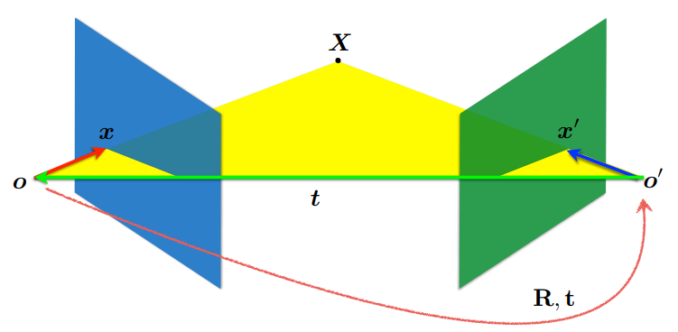

# 3D Reconstruction
## camera model
- camera matrix   
K - intrinsic<br>
R - rotation<br>
t - transformer<br>
P - camera matrix<br>
$Z^c \left[
 \begin{matrix}
   u \\
   v \\
   1
  \end{matrix}
  \right] = K[R|t] \left[
 \begin{matrix}
   X \\
   Y \\
   Z \\
   1
  \end{matrix}
  \right]$ <br>
  $P = K[R|t]$ <br>
- camera pose -> extrinsic<br>
C - camera location <br>
$R_C$ - pose rotation <br>
$R = R_c^T$ <br>
$t = -RC$ <br>
more detail [extrinsic](http://ksimek.github.io/2012/08/22/extrinsic/)   
## Essential & Fundamantal Matrix
- Essential Matrix
 <br>
$R = R_c, t = C$ in this case is camera pose.   
$E = [t×]R = \left[
 \begin{matrix}
   0 & -t_z & t_y \\
   t_z & 0 & -t_x \\
   -t_y & t_x & 0 
  \end{matrix}
  \right]R$   
  $F = K'^{-T}EK^{-1}$   
  $l'=Ex, l=E^Tx'$   
  $x'^TEx=0$    
  $e'^TE=0, Ee=0$   
- Fundamental matrix       
8 点法计算Fundamental matrix, Given p' p  
$A = [x'x, x'y, x', y'x, y'y, y', x, y, 1]_{N×9}$   
$U_{N×N},S,V_{9×9} = svd(A)$   
$F1 = V[-1].reshape(3,3)$ 最小二乘结果   
$U_{3*3},S_{3},V_{3×3} = svd(F1)$   
$S[-1] = 0$ 因为F矩阵秩为2   
$F = U\left[
 \begin{matrix}
   S[0] & 0 & 0 \\
   0 & S[1] & 0 \\
   0 & 0 & 0 
  \end{matrix}
  \right]V$    
  $E = U\left[
 \begin{matrix}
   1 & 0 & 0 \\
   0 & 1 & 0 \\
   0 & 0 & 0 
  \end{matrix}
  \right]V$   
## Camera Matrix P from Essential E
- create 4 possible camera matrices  
  $U,S,V = svd(E)$   
  $W = \left[
 \begin{matrix}
   0 & -1 & 0 \\
   1 & 0 & 0 \\
   0 & 0 & 1 
  \end{matrix}
  \right]$   
  假设$P_1 = [I|0]$，$P_2$四种可能参数   
  $P_2 = [UWV^T|U[:,2]]  \\ 
  P_2 = [UWV^T|-U[:,2]]  \\
  P_2 = [UW^TV^T|U[:,2]]  \\
  P_2 = [UW^TV^T|-U[:,2]]$   
  more detail in Hartley p 258    
  **Note:** $P_2=[R_c|C]$是camera pose, 转成extrinsic借助公式camera pose->extrinsic    
- Find the correct camera parameters  
4个camera parameter对应四种投影情况，找到能够使得点x和x'的$Z_c>0$的camera parameter.   
$\left[
 \begin{matrix}
   u_1 \\
   v_1 \\
   1
  \end{matrix}
  \right]×P_1\left[
 \begin{matrix}
   X \\
   Y \\
   Z \\
   1
  \end{matrix}
  \right] = \left[
 \begin{matrix}
   u_2 \\
   v_2 \\
   1
  \end{matrix}
  \right]×P_2\left[
 \begin{matrix}
   X \\
   Y \\
   Z \\
   1
  \end{matrix}
  \right] = 0$
```
def reconstruct_one_point(pt1, pt2, m1, m2):
    """
        pt1 and m1 * X are parallel and cross product = 0
        pt1 x m1 * X  =  pt2 x m2 * X  =  0
    """
    A = np.vstack([
        np.dot(skew(pt1), m1),
        np.dot(skew(pt2), m2)
    ])
    U, S, V = np.linalg.svd(A)
    P = np.ravel(V[-1, :4])
    return P / P[3] # P = [X,Y,Z,1]
#
for i, P2 in enumerate(P2s):
    # Find the correct camera parameters
    d1 = structure.reconstruct_one_point(points1n[:, 0], points2n[:, 0], P1, P2)
    P2_homogenous = extrinsic_from_camera_pose(P2)
    d2 = np.dot(P2_homogenous[:3, :4], d1) # d2 = [R|t]d1 is [X_c, Y_c, Z_c]

    if d1[2] > 0 and d2[2] > 0:
        ind = i
```    
或者可以直接从基础矩阵F推出P    
$P = [I|0]$   
$P' = [[e'_×]F|e']$   
## Triangulation
- find the 3D point X    
  Linear triangulation (Hartley ch 12.2 pg 312) to find the 3D point X.   
  $x=PX => x×PX = 0$    
  $\left[
 \begin{matrix}
   x \\
   y \\
   z
  \end{matrix}
  \right] = P\left[
 \begin{matrix}
   X \\
   Y \\
   Z \\
   1
  \end{matrix}
  \right] = \left[
 \begin{matrix}
   -p_1^T- \\
   -p_2^T- \\
   -p_3^T-
  \end{matrix}
  \right]\left[
 \begin{matrix}
   | \\
   X \\
   | 
  \end{matrix}
  \right] = \left[
 \begin{matrix}
   p_1^TX \\
   p_2^TX \\
   p_3^TX
  \end{matrix}
  \right]$    
  $P_1 = [I|0], P_2 = [R_c|C]$   
  $\left[
 \begin{matrix}
   x \\
   y \\
   1
  \end{matrix}
  \right] × \left[
 \begin{matrix}
   p_1^TX \\
   p_2^TX \\
   p_3^TX
  \end{matrix}
  \right] = \left[
 \begin{matrix}
   yp_3^TX-p_2^TX \\
   p_1^TX-xp_3^TX \\
   xp_2^TX-yp_1^TX
  \end{matrix}
  \right] = \left[
 \begin{matrix}
   0 \\
   0 \\
   0
  \end{matrix}
  \right]$     
  $\left[
 \begin{matrix}
    yp_3^T-p_2^T \\
   p_1^T-xp_3^T  \\
   y'{p'}_3^T-{p'}_2^T \\
   {p'}_1^T-x'{p'}_3^T
  \end{matrix}
  \right]X = \left[
 \begin{matrix}
   0 \\
   0 \\
   0 \\
   0
  \end{matrix}
  \right] => AX=0$     
  to solve $AX=0$ using SVD    
  $X = V[-1, :] / V[-1, 3]$