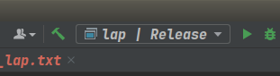

# Build 静态库

## Why

当项目很大时候，每次都有携带源码文件才能运行程序是非常冗余的，调用源码生成的库文件（`.a`, `.so`）文件将大大减少代码冗余。

## Build target library

- 文件列表

  ```
  - root
  |--- include
  |--------- laplacian_deformation.h
  |--- src
  |--------- laplacian_deformation.cpp
  |--- main.cpp
  |--- CMakeLists.txt
  ```

  

- 修改`CMakeLists.txt`文件

  ```cmake
  cmake_minimum_required(VERSION 2.6)
  project(deformation)
  
  # 包含头文件
  include_directories("include/")
  # 设置build出的 .a 静态库存放位置
  set(LIBRARY_OUTPUT_PATH /home/xiweijie/geoprocessing/geometry-processing-deformation/libs)
  # Build target .a library
  add_library(lap source/laplacian_deformation.cpp)
  target_link_libraries(lap igl::core igl::opengl igl::opengl_glfw)
  ```

  

- Build target

  ```bash
  mkdir build
  cd build
  cmake ../
  make
  ```

  或者在Clion中，点击 `锤子` build.

  

- Build后文件目录

  ```
  - root
  |--- build
  |------- CMakeFiles 
  |------- ...
  |--- libs
  |------- liblap.o
  |--- include
  |------- laplacian_deformation.h
  |--- src
  |------- laplacian_deformation.cpp
  |--- main.cpp
  |--- CMakeLists.txt
  ```

  

## link .a target library

- 将`src`文件移除项目目录

  ```
  - root
  |--- build
  |------- CMakeFiles 
  |------- ...
  |--- libs
  |------- liblap.o
  |--- include
  |------- laplacian_deformation.h
  |--- main.cpp
  |--- CMakeLists.txt
  ```

  

- 修改CMakeLists.txt

  ```cmake
  cmake_minimum_required(VERSION 2.6)
  project(deformation)
  
  set(EXE_NAME ${PROJECT_NAME})
  # 可执行文件 .exe
  add_executable(
          ${EXE_NAME}
          main.cpp)
  
  # .a 静态库的头文件，调用的 .h 接口
  set(EXE_INCLUDE
          include/)
  # .a 静态库所在的文件路径
  set(EXE_LIBPATH
          /home/xiweijie/geoprocessing/geometry-processing-deformation/libs)
  # .a 静态库对应的名字，lap 在EXE_LIBPATH下 liblap.a
  set(EXE_LIBNAME
          lap
          arap)
  
  target_include_directories(${EXE_NAME} PUBLIC ${EXE_INCLUDE})
  target_link_directories(${EXE_NAME} PUBLIC ${EXE_LIBPATH})
  target_link_libraries(${EXE_NAME} igl::core igl::opengl igl::opengl_glfw ${EXE_LIBNAME})
  ```


- 调用 `.h` 接口

  ```c++
  /// containing the header of the liblap.a & libarap.a, without .cpp files
  #include "laplacian_deformation.h"
  ```

  剩下与调用 `.cpp` 一样，正常调用函数、变量运行。


- Build & run

  ```bash
  cd build
  cmake ../
  make
  ```

  

- Build后文件目录

  ```
  - root
  |--- build
  |------- deformation.exe
  |------- ...
  |--- libs
  |------- liblap.o
  |--- include
  |------- laplacian_deformation.h
  |--- main.cpp
  |--- CMakeLists.txt
  ```

  

