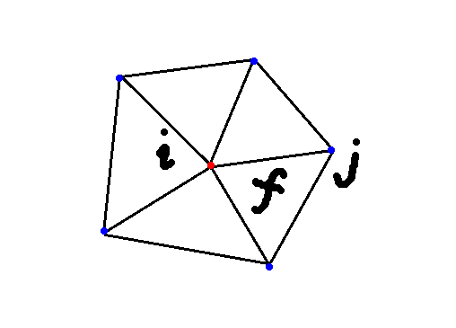

# Adjacency in Triangle


## 1. 寻找vertex `v_i`的领域点`j`

- C++ code<br>

	```c++
	/// 查找顶点 i 的领接顶点 j; 查找vertex i 所在的面集合
	/// \param F input: face of triangle mesh
	/// \param AV output: one-ring neighborhood vertex
	void adjacency_list(const Eigen::MatrixXi & F,
	                    std::vector<std::vector<int>> & AV,
	                    std::vector<std::vector<int>> & AF,
	                    std::vector<std::vector<int>> & AFi)
	{
	    AV.clear();
	
	    int n = F.maxCoeff() + 1;
	    AV.resize(n);
	
	    for(int f=0; f<F.rows(); f++) {
	        for(int m=0; m<F.cols(); m++) {
	            int i = F(f, m); // vertex i
	            int j = F(f, (m+1) % F.cols()); // vertex j
	            AV.at(i).push_back(j); // 将 vertex j 加入 i 的邻接集合中, 会存在重复
	            AV.at(j).push_back(i); // 将 vertex i 加入 j 的邻接集合中, 会存在重复
	        }
	    }
  
      // 去掉 A[i] 集合中重复元素
      for(int i=0; i<(int)AV.size(); ++i)
      {
          std::sort(AV[i].begin(), AV[i].end());
          AV[i].erase(std::unique(AV[i].begin(), AV[i].end()), AV[i].end());
      }
  }
  ```
  
  

**NOTE**: 遍历所有点`i`，将邻接`j`点加入集合中，但会有重复添加，需要去重复


## 2. vertex `i`所在face `j`的索引及对应的点索引`m`

```c++
/// 查找顶点 i 的领接顶点 j; 查找vertex i 所在的面集合
/// \param F input: face of triangle mesh
/// \param AF output: the faces of the vertex i belongs to
/// \param AFi output: the index of vertex i at the face in AF
void adjacency_list(const Eigen::MatrixXi & F,
                    std::vector<std::vector<int>> & AV,
                    std::vector<std::vector<int>> & AF,
                    std::vector<std::vector<int>> & AFi)
{
    AF.clear();
    AFi.clear();

    int n = F.maxCoeff() + 1;
    AF.resize(n);
    AFi.resize(n);

    for(int f=0; f<F.rows(); f++) {
        for(int m=0; m<F.cols(); m++) {
            int i = F(f, m); // vertex i
            int j = F(f, (m+1) % F.cols()); // vertex j
            AF[i].push_back(f);    // 将 vertex i 对应的所在面 f 加入 i 的面的集合中
            AFi[i].push_back(m);   // 将 vertex i 对应的在面 f 中的索引 m
        }
    }
}
```

