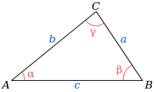
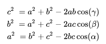
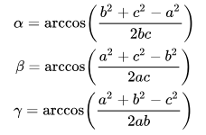

# Angle of vertex of triangle
## 1. using cosine rule
- 计算公式:<br>
	- [Using_cosine rule](https://en.wikipedia.org/wiki/Triangle#Sine,_cosine_and_tangent_rules)<br>
		<br>
		<br>
		<br>
	
- C++ code<br>
	
	```c++
	void internal_angles(const Eigen::MatrixXd & V,
	                     const Eigen::MatrixXi & F,
	                     Eigen::MatrixXd & A) {
	    int F_nums = F.rows();
	    Eigen::MatrixXd L_sq;
	    A.resize(F_nums, 3);
	    L_sq.resize(F_nums, 3);
	    
	    /// 计算每条边长度的平方 a^2, b^2, c^2
	    for(int i=0; i<F_nums; i++) {
	        Eigen::Vector3d v1 = V.row(F(i, 0));
	        Eigen::Vector3d v2 = V.row(F(i, 1));
	        Eigen::Vector3d v3 = V.row(F(i, 2));
	
	        Eigen::Vector3d e_a = v2 - v3; /// v1的对边
	        Eigen::Vector3d e_b = v3 - v1; /// v2的对边
	        Eigen::Vector3d e_c = v1 - v2; /// v3的对边
	
	        L_sq.row(i) << e_a.squaredNorm(), e_b.squaredNorm(), e_c.squaredNorm();
	
	        /// a^2 = b^2 + c^2 - 2*b*c*Cos(A)
	        /// https://en.wikipedia.org/wiki/Triangle#Sine,_cosine_and_tangent_rules
	        for(int d=0; d<3; d++) {
	            double s1 = L_sq(i, d);
	            double s2 = L_sq(i, (d+1) % 3);
	            double s3 = L_sq(i, (d+2) % 3);
	
	            A(i, d) = 360. * acos((s3 + s2 - s1) / (2. * sqrt(s3 * s2))) / (2*igl::PI);
	        }
	    }
	}
	```
	
	
	**NOTE:** `internal_angles`函数返回的是角度, 角度-弧度转换公式见[弧度](https://zh.wikipedia.org/wiki/%E5%BC%A7%E5%BA%A6)
