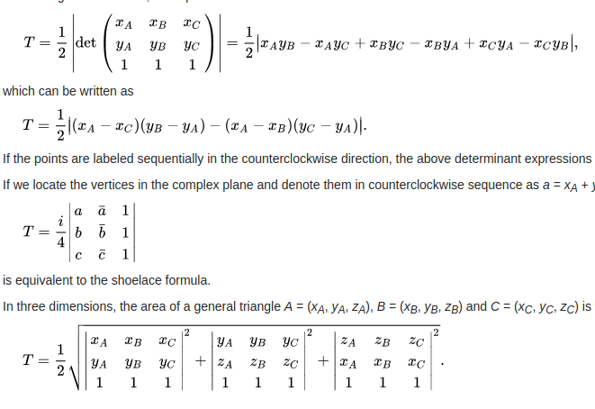
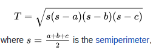
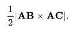

# Area of Triangle
## 1. using coordinates
- 计算公式:<br>
	- [Using_coordinates](https://en.wikipedia.org/wiki/Triangle#Using_coordinates)<br>
	
	  
	
- C++ code<br>
	
	```c++
	void doublearea(const Eigen::MatrixXd & V,
		            const Eigen::MatrixXi & F,
		            Eigen::Matrix<double, Eigen::Dynamic, 1> & A){
		    A.setZero(F.rows(), 1);
		    /// 计算triangle面积, 采用shoelace formula, 具体参考
		    /// https://en.wikipedia.org/wiki/Triangle#Using_coordinates
		    for(int i=0; i<F.rows(); i++) {
		        for(int j=0; j<3; j++) {
		            int x = j;
		            int y = (j+1) % 3;
		            double rx = V(F(i, 0), x) - V(F(i, 2), x); /// X_A - X_C
		            double sy = V(F(i, 1), y) - V(F(i, 0), y); /// Y_B - Y_A
		            double ry = V(F(i, 0), x) - V(F(i, 1), x); /// X_A - X_B
		            double sx = V(F(i, 2), y) - V(F(i, 0), y); /// Y_C - Y_A
		            double square_sum = pow((rx * sy - ry * sx),2); /// ||(X_A - X_C) * (Y_B - Y_A) - (X_A - X_B) * (Y_C - Y_A)||2
		            A(i, 0) += square_sum;
		        }
		        A(i, 0) = sqrt(A(i, 0));
		        /// 正常来说, 计算triangle面积需要乘 1/2, 但这里返回的是2倍的面积
		        //A(i, 0) /= 2.0;
		    }
  	}
  ```
  
  

## 2. Using Heron's formula

- 计算公式:<br>
	- [Using Heron's formula](https://en.wikipedia.org/wiki/Triangle#Using_Heron's_formula)<br>
	
	  
	
- C++ code<br>
	
	```c++
	void doublearea2(const Eigen::MatrixXd & V,
	                 const Eigen::MatrixXi & F,
	                 Eigen::Matrix<double, Eigen::Dynamic, 1> & A){
      A.setZero(F.rows(), 1);
	    for(int i=0; i<F.rows(); i++) {
	        /// 三个顶点
	        Eigen::Vector3d v1 = V.row(F(i, 0));
	        Eigen::Vector3d v2 = V.row(F(i, 1));
	        Eigen::Vector3d v3 = V.row(F(i, 2));
  
	        /// 三条边
	        Eigen::Vector3d e1 = v1 - v2;
	        Eigen::Vector3d e2 = v2 - v3;
	        Eigen::Vector3d e3 = v3 - v1;
  
	        /// 三条边的边长
	        double l1 = e1.norm();
	        double l2 = e2.norm();
	        double l3 = e3.norm();
  
	        /// Using Heron's formula
	        /// https://en.wikipedia.org/wiki/Triangle#Using_Heron's_formula
	        double s = 0.5 * (l1 + l2 + l3);
	        A(i, 0) = 2 * sqrt(s * (s - l1) * (s - l2) * (s - l3));
	    }
	}
  ```


## 3. Using vectors

- 计算公式:<br>
	- [Using vectors](https://en.wikipedia.org/wiki/Triangle#Using_vectors)<br>
	
	  
- C++ code<br>
	
	```c++
	void doublearea3(const Eigen::MatrixXd & V,
					const Eigen::MatrixXi & F,
					Eigen::Matrix<double, Eigen::Dynamic, 1> & A){
  	A.setZero(F.rows(), 1);
	    for(int i=0; i<F.rows(); i++) {
	        /// 三个顶点
	        Eigen::Vector3d v1 = V.row(F(i, 0));
	        Eigen::Vector3d v2 = V.row(F(i, 1));
	        Eigen::Vector3d v3 = V.row(F(i, 2));
  
	        /// 两条边
	        Eigen::Vector3d e1 = v1 - v2;
	        Eigen::Vector3d e2 = v2 - v3;
  
	        /// 叉乘获得的n是未经过归一化的normal
	        Eigen::Vector3d n = e1.cross(e2);
  
	        /// 面积Area = 0.5 * det(n)
	        /// https://en.wikipedia.org/wiki/Triangle#Using_vectors
	        double a = n.norm();
	        A(i, 0) = a;
	    }
	}
  ```

