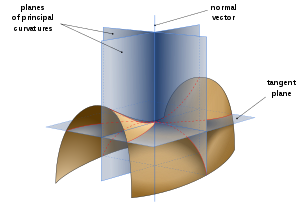
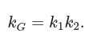
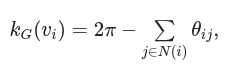
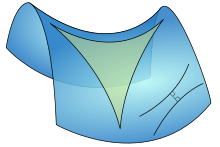
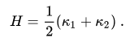
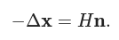

# Curvature
## 1. Principal curvature

- [主曲率](https://zh.wikipedia.org/wiki/%E4%B8%BB%E6%9B%B2%E7%8E%87)
- 维基百科定义: 在曲面上取一点E，曲面在E点的法线为z轴，过z轴可以有无限多个剖切平面，每个剖切平面与曲面相交，其交线为一条平面曲线，每条平面曲线在E点有一个曲率半径。不同的剖切平面上的平面曲线在E点的曲率半径一般是不相等的。这些曲率半径中，有一个最大和最小的曲率半径，称之为主曲率半径，记作 *k*1 与 *k*2，这两个曲率半径所在的方向，数学上可以证明是相互垂直的。
- 

## 2. Gaussian Curvature

- [高斯曲率](https://zh.wikipedia.org/wiki/%E9%AB%98%E6%96%AF%E6%9B%B2%E7%8E%87)
- 两个主曲率的乘积 k1k2 是高斯曲率 K_G
- 

- 离散高斯曲率定义为

  

- 高斯曲率含义: 

  

  - **负曲率**曲面上的三角形三角之和小于平面三角形的三角之和。
  - **正曲率**曲面上的三角形三角之和小于平面三角形的三角之和。

- C++ code

  ```c++
  void gaussian_curvature(const Eigen::MatrixXd & V,
                          const Eigen::MatrixXi & F,
                          Eigen::MatrixXd & K) {
      /// 计算每个conner的角度
      Eigen::MatrixXd A;
      internal_angles(V, F, A);
      K.setConstant(V.rows(), 1, 2*igl::PI);
  
      /// K_G(x_i) = (2π - ∑θj)
      for(int i=0; i<F.rows(); i++) {
          for(int j=0; j<3; j++) {
              K(F(i, j), 0) -= A(i, j);
          }
      }
  }
  ```

  


## 3. Mean curvature

- [平均曲率](https://zh.wikipedia.org/wiki/%E5%B9%B3%E5%9D%87%E6%9B%B2%E7%8E%87)

- 主曲率的平均值 (k1+k2)/2 是平均曲率 H

  

- 对 3 维空间中的曲面，平均曲率与曲面的单位法向量相关：

  
