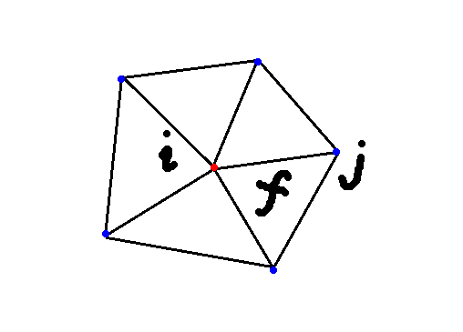

# K-Ring


- 以图中`j`为示，vertex`j`是vertex`i`的`one-ring`的邻接点

- C++ code

  ```c++
  /// 获取 vertex i 的 k-ring 邻接点
  /// \param V input: vertex
  /// \param start input: 起始点vertex i
  /// \param r input: K-ring的k, 也是radius
  /// \param AV input: one-ring neighborhood vertex
  /// \param vv output: vertex i 的k-ring邻接点
  void getKRing(const Eigen::MatrixXd & V,
                const int start, const double r,
                const std::vector<std::vector<int>> & AV,
                std::vector<int>& VKring)
  {
      int bufsize=V.rows();
      VKring.reserve(bufsize);
      std::list<std::pair<int,int> > queue; // BFS use queue
      std::vector<bool> visited(bufsize, false);
      queue.push_back(std::pair<int,int>(start,0));
      visited[start]=true;
  
      // BSF find k-ring neighborhood
      while (!queue.empty())
      {
          int toVisit=queue.front().first;
          int distance=queue.front().second;
          queue.pop_front();
          VKring.push_back(toVisit);
          // if distance < r(k-ring) push in queue
          if (distance<(int)r)
          {
              for (unsigned int i=0; i<AV[toVisit].size(); ++i)
              {
                  int neighbor=AV[toVisit][i];
                  if (!visited[neighbor]) // non-visited before
                  {
                      queue.push_back(std::pair<int,int> (neighbor,distance+1));
                      visited[neighbor]=true;
                  }
              }
          }
      }
  }
  ```

  
