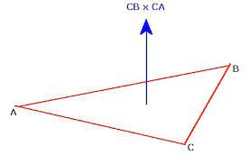
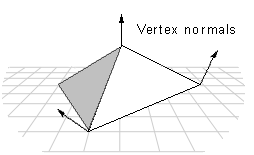

# triangle normal computation
## 1. per faces normal
- per-faces-normal也就是triangle每个面上的normal, 是constant的<br>

- 计算公式:<br>


- C++ code
```c++
void per_face_normal(const Eigen::MatrixXd & V,
                     const Eigen::MatrixXi & F,
                     Eigen::MatrixXd & N_faces){
    N_faces.resize(F.rows(), 3);
    for(int i=0; i<F.rows(); i++) {
        Eigen::Vector3d v1 = V.row(F(i, 0));
        Eigen::Vector3d v2 = V.row(F(i, 1));
        Eigen::Vector3d v3 = V.row(F(i, 2));

        Eigen::Vector3d e1 = v1 - v2; /// 边 e1
        Eigen::Vector3d e2 = v1 - v3; /// 边 e2
        N_faces.row(i) = e1.cross(e2); /// 叉乘
    }
}
```

## 2. per vertex normal
- per-vertex-normal是各个vertex上的normal, 也就是将vertex v_i所在面$F(k)$上的normal(上一步per-faces-normal) $n_k$加权加权平均赋给其vertex. 加权的weight采用triangle的面积.

- 计算公式<br>


- C++ code
```C++
void per_vertex_normals(const Eigen::MatrixXd & V,
                        const Eigen::MatrixXi & F,
                        Eigen::MatrixXd & N_vertices){
    Eigen::MatrixXd N_faces;
    per_face_normal(V, F, N_faces);

    N_vertices.setZero(V.rows(), 3);
    Eigen::Matrix<double, Eigen::Dynamic, 1> A;
    doublearea(V,F,A);
    Eigen::MatrixXd W = A.replicate(1, 3);

    for(int f=0; f<F.rows(); f++) {
        /// 将面上的normal分配给面上的三个vertex
        for(int i=0; i<3; i++) {
            N_vertices.row(F(f, i)) += W(f, i) * N_faces.row(f);
        }
    }
    N_vertices.rowwise().normalize(); /// 归一化
}
```