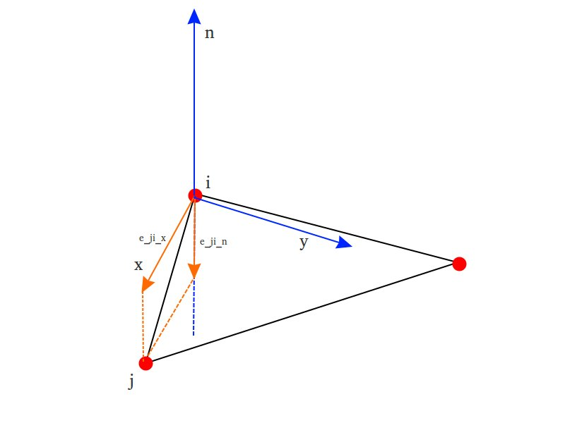

# Reference Coordinate
## task

- 给定triangle mesh的vertex `i`的vertex normal `n`, 以`n`为z-axis，建立坐标系



## 1. build reference coordinate

- x-axis

  

  

  

  

- y-axis

  

- C++ code

  ```c++
  /// 对每个 vertex i 和 j 计算参考坐标系, 其中 x_axis = [i -> j], z_axis = \vec(n), y_axis = x_axis \times z_axis
  /// \param i input: vertex i
  /// \param V input: Vertex set
  /// \param n input: normal vector of vertex i
  /// \param AV input: one-ring neighborhood vertex
  /// \param ref output: reference coordinate
  void computeReferenceFrame(int i,
                             const Eigen::MatrixXd & V,
                             const Eigen::Vector3d& n,
                             const std::vector<std::vector<int>> & AV,
                             std::vector<Eigen::Vector3d>& ref)
  {
      Eigen::Vector3d vj = Eigen::Vector3d(V.row(AV[i][0]));
      Eigen::Vector3d vi = Eigen::Vector3d(V.row(i));
  
      Eigen::Vector3d eji = vj - vi;
      double cos = eji.dot(n); // the cos of eji between n
      Eigen::Vector3d eji_proj_n = n * cos; // the sub vector of eji projected onto n
  
      // because eji = eji_proj_n + eji_proj_x_axis
      Eigen::Vector3d x_axis = (eji - eji_proj_n).normalized();
  
      // 根据右手螺旋法则, y_axis = n X x_axis
      Eigen::Vector3d y_axis=(n.cross(x_axis)).normalized();
      ref[0] = x_axis;
      ref[1] = y_axis;
      ref[2] = n;
  }
  ```

  
