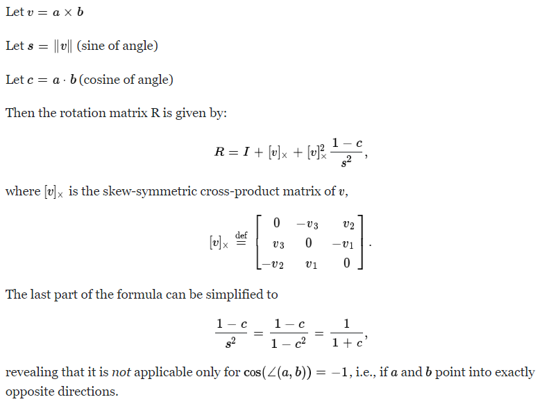

# Rotation

## 1 Rotate with aligned axis

- 在3D坐标系下的旋转，可以是以一种分别沿着x-axis, y-axis, z-axis旋转$\alpha$, $\beta$, $\gamma$角度得到各自旋转，然后进行矩阵组合：

    

    

    - python code

    ```python
    def rotate_with_aligned_axis(alpha, beta, gamma):
        alpha_rad = np.deg2rad(alpha)
        beta_rad = np.deg2rad(beta)
        gamma_rad = np.deg2rad(gamma)

        R_x = np.eye(4, dtype=np.float32)
        R_y = np.eye(4, dtype=np.float32)
        R_z = np.eye(4, dtype=np.float32)

        R_x[1, 1] = np.cos(alpha_rad); R_x[1, 2] = - np.sin(alpha_rad)
        R_x[2, 1] = np.sin(alpha_rad); R_x[2, 2] = np.cos(alpha_rad)

        R_y[0, 0] = np.cos(beta_rad); R_y[0, 2] = np.sin(beta_rad)
        R_y[2, 0] = - np.sin(beta_rad); R_y[2, 2] = np.cos(beta_rad)

        R_z[0, 0] = np.cos(gamma_rad); R_z[0, 2] = - np.sin(gamma_rad)
        R_z[1, 0] = np.sin(gamma_rad); R_z[1, 1] = np.cos(gamma_rad)

        return np.matmul(R_x, np.matmul(R_y, R_z))
    ```

## 2 Rotate with arbitrary axis

- 只是绕着aligned-axis旋转，会存在[**万向节锁**](https://v.youku.com/v_show/id_XNzkyOTIyMTI=.html)的问题，如果绕着任意axis (vector in 3d) 旋转的话，更加高效。

- 绕任意轴旋转，根据罗德里戈公式（推导过程见[旋转之二 - 三维空间中的旋转:罗德里格旋转公式](https://zhuanlan.zhihu.com/p/85862903)）

    

    - python code

    ```python
    def rotate_with_arbitrary_axis(axis, theta):
        theta_rad = np.deg2rad(theta)
        axis = axis / np.linalg.norm(axis)
        axis = np.reshape(axis, (3, 1))

        N = np.zeros(shape=(3, 3), dtype=np.float32)
        N[0, 1] = - axis[2]; N[0, 2] = axis[1]
        N[1, 0] = axis[2]; N[1, 2] = - axis[0]
        N[2, 0] = - axis[1]; N[2, 1] = axis[0]

        R = np.cos(theta_rad) * np.eye(3, dtype=np.float32) + (1 - np.cos(theta_rad)) * np.matmul(axis, axis.T) + np.sin(theta_rad) * N

        return R
    ```

## 3 Rotate from vFrom to vTo

- 在平常开发中，经常会有需要计算从一个向量`vFrom`到另一个向量`vTo`的旋转矩阵的情况，本着拿来主义，这里的公式是：

    

    - python code

    ```python
    def rotate_vFrom_to_vTo(vFrom, vTo):
        vFrom = vFrom / np.linalg.norm(vFrom)
        vTo = vTo / np.linalg.norm(vTo)

        c = np.dot(vFrom, vTo)
        R = np.eye(3, dtype=np.float32)

        if np.abs(c - 1.0) < 1e-4 or np.abs(c + 1.0) < 1e-4:
            return R
        
        v = np.cross(vFrom, vTo)
        v_x = np.array([
            [0., -v[2], v[1]],
            [v[2], 0., -v[0]],
            [-v[1], v[0], 0.]
        ], dtype=np.float32)

        R += v_x + v_x @ v_x / (1 + c)

        return R
    ```

## 4 Rotate from one points set to another

- 经典面试问题：给你一堆点集$\mathbf{X}$, 再给你经过旋转、平移变换过后的点集$\mathbf{Y}$, 求从$\mathbf{X}$到$\mathbf{Y}$的旋转和平移。

- 参考论文[Least-Squares Fitting of Two 3-D Point Sets](https://github.com/liulinbo/slam/blob/master/Least-Squares%20Fitting%20of%20Two%203-D%20Point%20Sets.pdf), 求解步骤：

    1. 对$\mathbf{X}$和$\mathbf{Y}$计算均值$\mathbf{\bar{X}}$和$\mathbf{\bar{Y}}$,

    2. 归一化：$\mathbf{\hat{X}} = \mathbf{X} - \mathbf{\bar{X}}$, $\mathbf{\hat{Y}} = \mathbf{Y} - \mathbf{\bar{Y}}$,

    3. 尺寸缩放 $s = \frac{\sum_i \Vert \mathbf{\hat{X}}_i \Vert_2}{\sum_i \Vert \mathbf{\hat{Y}}_i \Vert_2}$,

    4. 令 $\mathbf{A} = s (\mathbf{X} - \mathbf{\bar{X}})^T(\mathbf{Y} - \mathbf{\bar{Y}}) $,

    5. 奇异值分解：$\mathbf{U}, \Sigma, \mathbf{V} = svd(\mathbf{A})$,

    6. $\mathbf{R} = \mathbf{V}\mathbf{U}^T$,

    7. translate $t = \mathbf{\bar{Y}} - s \mathbf{R} \mathbf{\bar{X}}$,

    8. return $s, \mathbf{R}, t$

    - python code

    ```python
    def compute_transformation(X, Y):
        """
        X -- [N, 3]
        Y -- [N, 3]
        return R|t
        """
        X_mean = np.mean(X, axis=0)
        Y_mean = np.mean(Y, axis=0)

        X_hat = X - X_mean
        Y_hat = Y - Y_mean
        s = np.sum(np.linalg.norm(Y_hat, axis=1), axis=0) / np.sum(np.linalg.norm(X_hat, axis=1), axis=0)

        A = s * X_hat.T @ Y_hat
        U, _, Vh = np.linalg.svd(A, full_matrices=True)

        R = Vh.T @ U.T

        t = Y_mean - s * R @ X_mean

        return s, R, t
    ```

## 5 Code url

- [rotation.py](./rotation.py)

## 6. Reference

- [旋转之二 - 三维空间中的旋转:罗德里格旋转公式](https://zhuanlan.zhihu.com/p/85862903)

- [旋转之三 - 旋转矩阵](https://zhuanlan.zhihu.com/p/86223712)

- [SVD的应用](https://zhuanlan.zhihu.com/p/115135931)

- [Calculate Rotation Matrix to align Vector A to Vector B in 3d?](https://math.stackexchange.com/questions/180418/calculate-rotation-matrix-to-align-vector-a-to-vector-b-in-3d)

- [Least-Squares Fitting of Two 3-D Point Sets](https://github.com/liulinbo/slam/blob/master/Least-Squares%20Fitting%20of%20Two%203-D%20Point%20Sets.pdf)