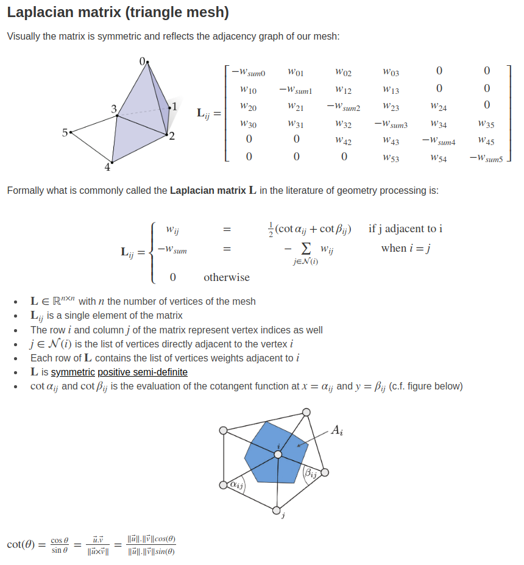

# Cotangent Laplacian Operator

## 1. Discrete Laplace operator



- the picture from [Definition: Laplacian Matrix for triangle meshes](http://rodolphe-vaillant.fr/?e=101)


## 2. C++ Code

- Cotangent weight

  ```c++
  /// Compute cotangent between each edge ij
  /// \param V vertex
  /// \param F faces
  /// \param C cotangent
  void cotmatrix_entries(const Eigen::MatrixXd & V,
                 const Eigen::MatrixXi & F,
                 Eigen::Matrix<double, Eigen::Dynamic, Eigen::Dynamic> & C)
  {
      using namespace std;
      using namespace Eigen;
      // Number of elements
      int m = F.rows();
      // Triangles
      //Compute Squared Edge lengths
      Matrix<double, Dynamic, 3> l2;
      squared_edge_lengths(V,F,l2);
      //Compute Edge lengths
      Matrix<double, Dynamic, 3> l;
      l = l2.array().sqrt();
  
      // double area
      Matrix<double, Dynamic, 1> dblA;
      doublearea(V, F, dblA);
  
      // cotangents and diagonal entries for element matrices
      // correctly divided by 4 (alec 2010)
      C.resize(m,3);
      for(int i = 0;i<m;i++)
      {
          // Alec: I'm doubtful that using l2 here is actually improving numerics.
          C(i,0) = (l2(i,1) + l2(i,2) - l2(i,0))/dblA(i)/4.0;
          C(i,1) = (l2(i,2) + l2(i,0) - l2(i,1))/dblA(i)/4.0;
          C(i,2) = (l2(i,0) + l2(i,1) - l2(i,2))/dblA(i)/4.0;
      }
  }
  ```

- Cotangent Laplacian Matrix

  ```c++
  /// Cotangent laplacian weight matrix
  /// \param V vertex
  /// \param F faces
  /// \param L cotangent weight matrix
  void cotmatrix(const Eigen::MatrixXd & V,
                 const Eigen::MatrixXi & F,
                 Eigen::SparseMatrix<double> & L)
  {
      using namespace Eigen;
      using namespace std;
  
      L.resize(V.rows(),V.rows());
      Matrix<int,Dynamic,2> edges;
      // This is important! it could decrease the comptuation time by a factor of 2
      // Laplacian for a closed 2d manifold mesh will have on average 7 entries per
      // row
      L.reserve(10*V.rows());
      edges.resize(3,2);
      edges <<
          1,2,
          2,0,
          0,1;
  
      // Gather cotangents
      Matrix<double, Dynamic, Dynamic> C;
      cotmatrix_entries(V, F,C);
  
      vector<Triplet<double> > IJV;
      IJV.reserve(F.rows()*edges.rows()*4);
      // Loop over triangles
      for(int i = 0; i < F.rows(); i++)
      {
          // loop over edges of element
          for(int e = 0; e<edges.rows(); e++)
          {
              int source = F(i,edges(e,0));
              int dest = F(i,edges(e,1));
              IJV.push_back(Triplet<double>(source, dest, C(i,e)));
              IJV.push_back(Triplet<double>(dest, source, C(i,e)));
              IJV.push_back(Triplet<double>(source, source, -C(i,e)));
              IJV.push_back(Triplet<double>(dest, dest, -C(i,e)));
          }
      }
      L.setFromTriplets(IJV.begin(),IJV.end());
  }
  ```

  

