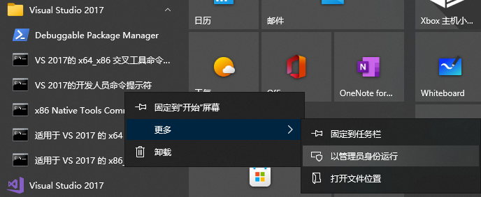
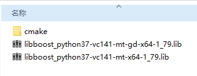
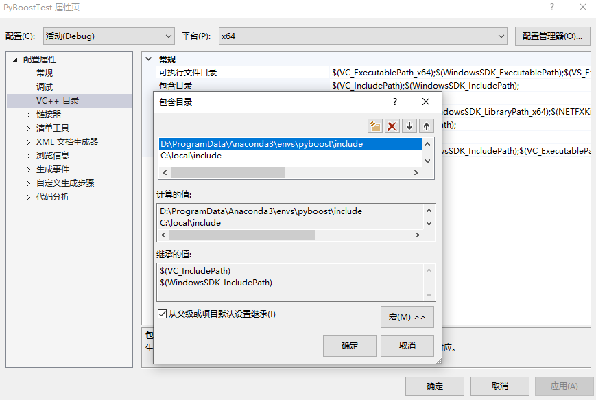
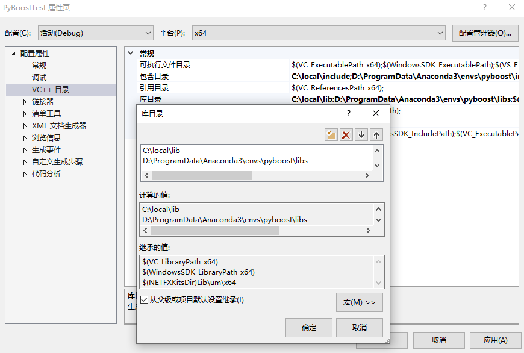

# Py-Boost build on win10 with MSVC
## 0. Download
- Visual Studio 2022
- CMake
- Conda
- [Boost 1.79](https://nchc.dl.sourceforge.net/project/boost/boost/1.79.0/boost_1_79_0.zip)

## 1. Installation
- 开发人员命令提示符



- build

    ```bash
    cd \path\to\boost_1_79_0
    call bootstrap.bat
    ```

    出现`b2.exe`, 接着安装

    ```bash
    rem Visual Studio 2012 -> set msvcver=msvc-11.0
    rem Visual Studio 2013 -> set msvcver=msvc-12.0
    rem Visual Studio 2015 -> set msvcver=msvc-14.0
    rem Visual Studio 2017 -> set msvcver=msvc-14.1
    set msvcver=msvc-14.1

    rem conda python=3.7 env
    conda create -n pyboost python=3.7
    conda activate pyboost

    b2 stage --stagedir=stage/x64 --with-python toolset=%msvcver% address-model=64 link=static threading=multi runtime-link=shared --build-type=complete -j8
    ```

    `b2`参数比较多，可参考[boost b2/bjam 参数说明](https://blog.csdn.net/zhangzq86/article/details/90030094)

    如果不报错，生成py-boost的静态库。如果想生成全部的Boost库，将`--with-python`去掉即可。

    

    [可选]把生成的lib拷贝到`C:/local/`
    ```bash
    set boost_dir=%cd%
    cd C:/
    mkdir local

    xcopy %boost_dir%\stage\x64\lib\*.lib .\local\lib /s /y /q
    xcopy %boost_dir%\stage\x64\lib\*.dll .\local\bin /s /y /q
    xcopy %boost_dir%\boost\* .\local\include\boost\ /s /y /q
    ```

## 2. Using PyBoost
### 2.1.a Visual Studio Setup

- include

    `项目` -> `属性` -> `VC++目录` -> `包含目录`

    包含`python`以及刚编译成功的`Python-Boost`include目录

     

- lib

    `项目` -> `属性` -> `VC++目录` -> `库目录`

    包含`python`以及刚编译成功的`Python-Boost`lib目录

    

- 输出设置

    `项目` -> `属性` -> `常规` -> `配置类型` & `目标文件扩展名`

    先设置配置类型为`.dll`，目标文件扩展名为`.pyd`

    

    Visual Studio Setup 可以参考[Windows 安装 Boost Python 并使用 Visual Studio 2019 或 Clion 编译 (Python调用C++) ](https://blog.forgiveher.cn/posts/1574671900/)

- build .pyd

    在Visual Studio中，Relase x64模式，`生成` -> `生成解决方案`。在\x64\Release\下获取`PyBoostTest.pyd`

### 2.1.a CMake Setup

    除了使用Visual Studio外，也可以使用CMake工具帮助build

- CMakeLists.txt

    ```CMake
    cmake_minimum_required(VERSION 3.21)
    project(PyBoostTest)

    # C++ 17
    set(CMAKE_CXX_STANDARD 17)

    # include
    set(INCLUDE_H ${PROJECT_SOURCE_DIR}/inc)
    set(INCLUDE_ADD "path\to\boost\include" 
                    "path\to\python\include")
    include_directories(${INCLUDE_H} ${INCLUDE_ADD})

    # lib
    set(LIB_PATH ${PROJECT_SOURCE_DIR}/lib)
    set(LIB_ADD "path\to\boost\libs" 
                "path\to\python\lib")
    file(GLOB_RECURSE LIB_FILES ${LIB_PATH}/*.lib ${LIB_add}/*.lib)
    link_directories(${LIB_PATH} ${LIB_ADD})

    message("*** LIB_PATH: ${LIB_PATH}")
    message("*** LIB_FILES: ${LIB_FILES}")

    # src
    aux_source_directory(${PROJECT_SOURCE_DIR}/src DIR_SRCS)

    # pyd
    add_library(PyBoostTest ${DIR_SRCS})
    target_link_libraries(PyBoostTest ${LIB_FILES})

    # suffix
    set (EXT ".so")
    if (WIN32)
        set (EXT ".pyd")
    endif()
    set_target_properties(PyBoostTest PROPERTIES PREFIX "" SUFFIX ${EXT})
    ```

- CMake --build

    ```CMake
    mkdir build
    cd build
    cmake "Visual Studio 15 2022" -A x64 ..
    cmake --build . --config Release -- /maxcpucount:8
    ```

    一样获取`PyBoostTest.pyd`

### 2.2 Code

- 具体测试源码见[PyBoostTest](./code/PyBoostTest)
- `.pyd`文件[PyBoostTest.pyd](./code/PyBoostTest/PyBoostTest.pyd)
- Wrapper
    ```C++
    #define BOOST_PYTHON_STATIC_LIB
    #include <boost/python.hpp>
    #include <boost/python/module.hpp>
    #include <boost/python/def.hpp>

    #include <iostream>
    #include "Num.h"

    using namespace boost::python;
    using namespace std;

    char const* greet() 
    {
        return "hello, world";
    }

    int generateZero()
    {
        return 0;
    }

    void printNum(Num & num)
    {
        std::cout << num.get() << std::endl;
    }

    BOOST_PYTHON_MODULE(PyBoostTest)
    {
        // 普通 python 函数
        def("greet", greet);
        def("generateZero", &generateZero);
        def("printNum", &printNum);

        // 类
        class_<Num>("Num", init<>()) // init<>()默认构造
            .def(init<float>()) // 有参构造
            .def("get", &Num::get) // 成员函数
            .def("set", &Num::set)
            .def("clear", &Num::clear)
        ;
    }
    ```

    `BOOST_PYTHON_MODULE(module_name)`对外输出，其中module_name会与最终输出的`.pyd`名称对上，也即在python中，`import module_name`

    Boost.Python语法可以参考[boost.python笔记](https://www.jianshu.com/p/0fee49c58caa)。

### 2.3 Run

- in python test code [PyBoostTest](./code/PyBoostTest/PyBoostTest.py)

    ```Python
    import PyBoostTest

    def test_pyBoost():
        print(PyBoostTest.greet()) # say hello world
        num_a = PyBoostTest.generateZero() # generate num 0 -> num_a

        num_A = PyBoostTest.Num(2.5) # Class Num() -> num_A object
        PyBoostTest.printNum(num_A) # print object num_A

        num_A.set(10.0) # set
        print(num_A.get()) # get

        num_A.clear() # clear data
        PyBoostTest.printNum(num_A)


    if __name__ == "__main__":
        test_pyBoost()
    ```

- result
    ```Bash
    hello, world
    2.5
    10.0
    0
    ```