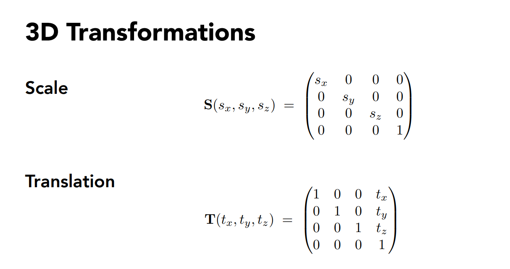
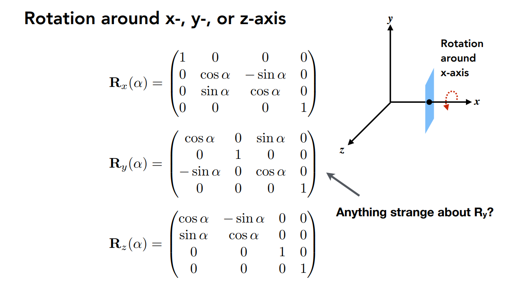
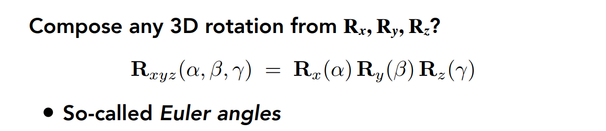
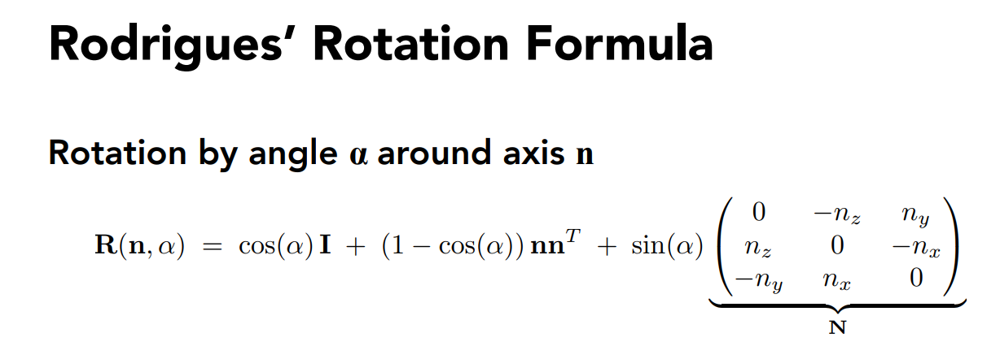
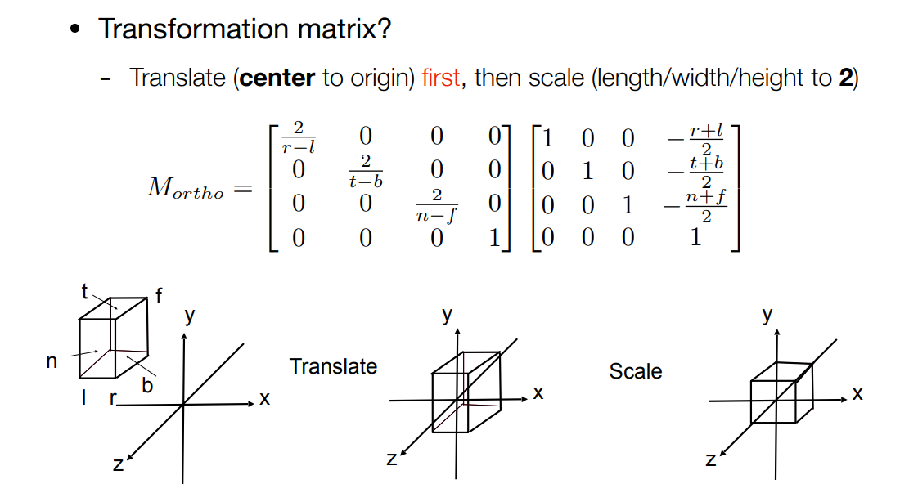
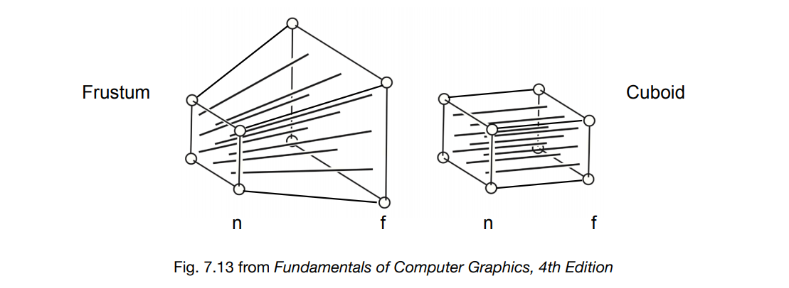
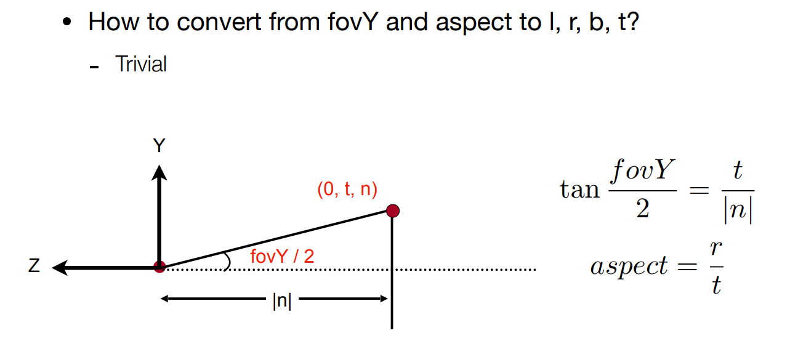

# Assignment1

- [link](http://games-cn.org/forums/topic/graphics-intro-hw1/)
- [理论参考](https://blog.csdn.net/why18767183086/article/details/107237618)

## get_model_matrix
- **Model transformation**: 对一个物体进行 Rotation, Scale, Transformation 变换
- Scale & Transformation<br>
  
- Rotation<br>
  
- 欧拉角
  
- 绕任意轴旋转$\alpha$
  

- C++ code
  - 第一种方法，采用$R_z(\alpha)$
  
    ```c++
    Eigen::Matrix4f get_model_matrix(float rotation_angle)
    {
        Eigen::Matrix4f model = Eigen::Matrix4f::Identity();
    
        float alpha = rotation_angle / 180 * MY_PI; // aplha from angle to π
        Eigen::Matrix4f R;
        R <<   cos(alpha), sin(alpha), 0.0f, 0.0f,
             - sin(alpha), cos(alpha), 0.0f, 0.0f,
             0.0f,         0.0f,       1.0f, 0.0f,
             0.0f,         0.0f,       0.0f, 1.0f;
        
        model = R * model;
    
        return model;
    }
    ```
  
    
  
  - 第二种方法，采用罗德里格公式
  
    ```c++
    Eigen::Matrix4f get_model_matrix(float rotation_angle)
    {
        Eigen::Matrix4f model = Eigen::Matrix4f::Identity();
    
        float alpha = rotation_angle / 180 * MY_PI; // aplha from angle to π
        Eigen::Vector3f nz{0.0f, 0.0f, 1.0f}; // z-axis vector
    
        Eigen::Matrix3f N, R;
        N <<     0.0f, - nz.z(),   nz.y(),
               nz.z(),     0.0f, - nz.x(),
             - nz.y(),   nz.x(),     0.0f;
    
        R << cos(alpha) * Eigen::Matrix3f::Identity() + (1 - cos(alpha)) * nz * nz.transpose() + sin(alpha) * N;
        
        model.block(0, 0, 3, 3) << R;
    
        return model;
    }
    ```
  


## get_projection_matrix

- **Projection Transformation**: From 3D world coordinate to 2D screen

- Orthographic Projection:

  

- Perspective Projection

  
  $$
  M_{presp \rightarrow ortho} = \begin{bmatrix}
  n & 0 & 0 & 0 \\
  0 & n & 0 & 0 \\
  0 & 0 & n+f & -nf \\
  0 & 0 & 1 & 0
  \end{bmatrix}
  $$

  $$
  M_{persp} = M_{ortho}M_{persp \rightarrow ortho}
  $$
  

- C++ code

  ```c++
  Eigen::Matrix4f get_projection_matrix(float eye_fov, float aspect_ratio,
                                        float zNear, float zFar)
  {
      // Students will implement this function
  
      Eigen::Matrix4f projection = Eigen::Matrix4f::Identity();
  
      Eigen::Matrix4f Mp2o, Mo, Mo1;
      Mp2o << zNear, 0.0f,  0.0f, 0.0f,
              0.0f,  zNear, 0.0f, 0.0f,
              0.0f,  0.0f,  zNear + zFar, - zNear * zFar,
              0.0f,  0.0f,  1.0f, 0.0f;
  
      float fovY = eye_fov / 180 * MY_PI;
      float t = tan(fovY / 2) * abs(zNear);
      float r = aspect_ratio * t;
      float b = 0.0f - t;
      float l = 0.0f - r;
  
      Mo << 2.0f / (r - l), 0.0f,           0.0f,                  0.0f,
            0.0f,           2.0f / (t - b), 0.0f,                  0.0f,
            0.0f,           0.0f,           2.0f / (zNear - zFar), 0.0f,
            0.0f,           0.0f,           0.0f,                  1.0f;
      Mo1 << 1.0f, 0.0f, 0.0f, - (r + l) / 2.0f,
             0.0f, 1.0f, 0.0f, - (t + b) / 2.0f,
             0.0f, 0.0f, 1.0f, - (zNear + zFar) / 2.0f,
             0.0f, 0.0f, 0.0f, 1.0f;
      
      projection = Mo * Mo1 * Mp2o * projection;
  
      return projection;
  }
  ```


## get_rotation

- **目标**: 构造一个函数，该函数的作用是得到绕任意过原点的轴的旋转变换矩阵

- 罗德里格公式：

- C++ code

  ```c++
  Eigen::Matrix4f get_rotation(Vector3f axis, float angle)
  {
      Eigen::Matrix4f model = Eigen::Matrix4f::Identity();
  
      // TODO: Rotation around any axis by angle
  
      float alpha = angle / 180 * MY_PI; // aplha from angle to π
  
      Eigen::Matrix3f N, R;
      N << 0.0f,   - axis.z(),   axis.y(),
           axis.z(),     0.0f, - axis.x(),
         - axis.y(), axis.x(),       0.0f;
  
      R << cos(alpha) * Eigen::Matrix3f::Identity() + (1 - cos(alpha)) * axis * axis.transpose() + sin(alpha) * N;
  
      model.block(0, 0, 3, 3) << R;
  
      return model;
  }
  ```

  


## Build & Run

```bash
cd code
mkdir build && cd build
cmake ..
make -j8
./Rasterizer
```

