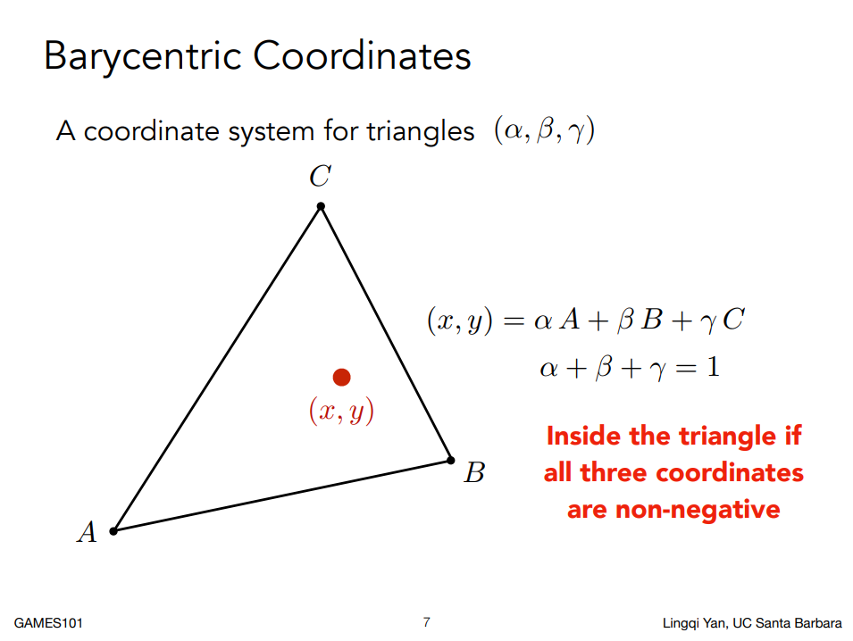
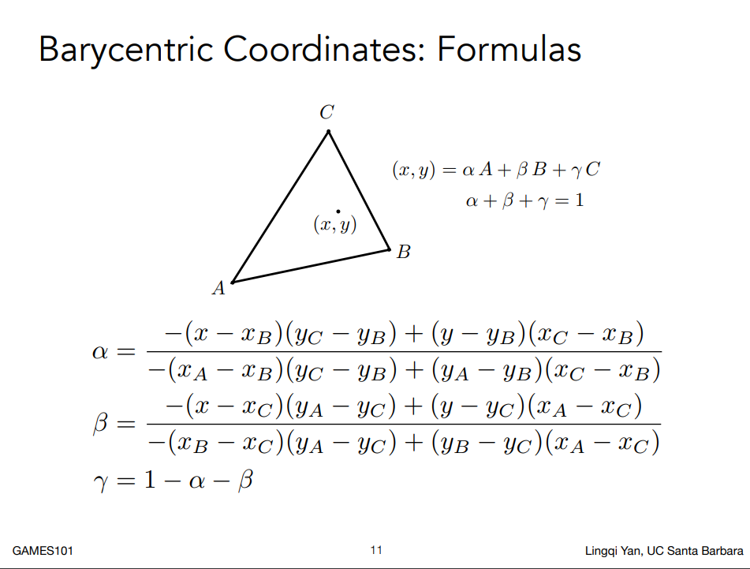
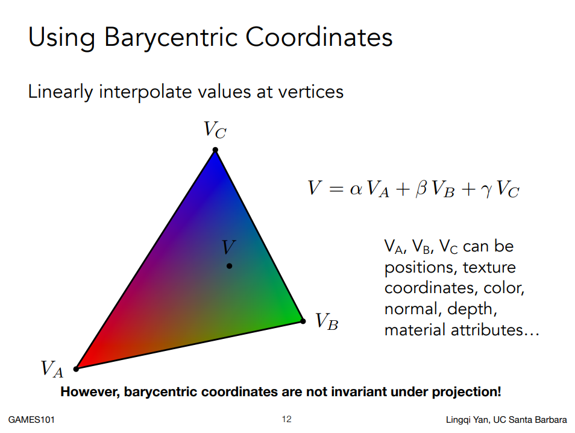
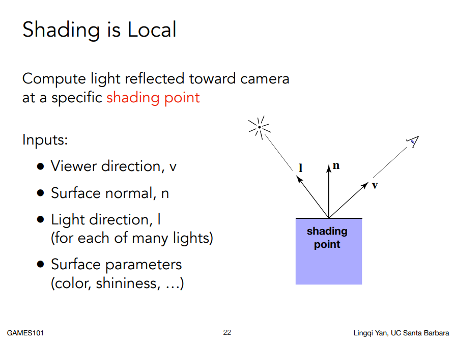
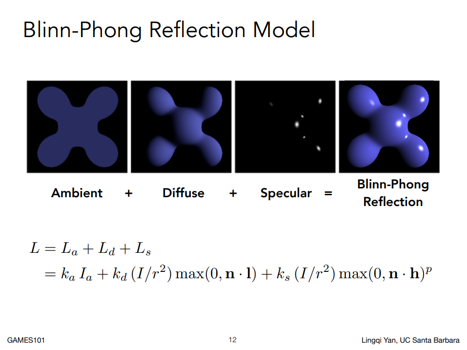
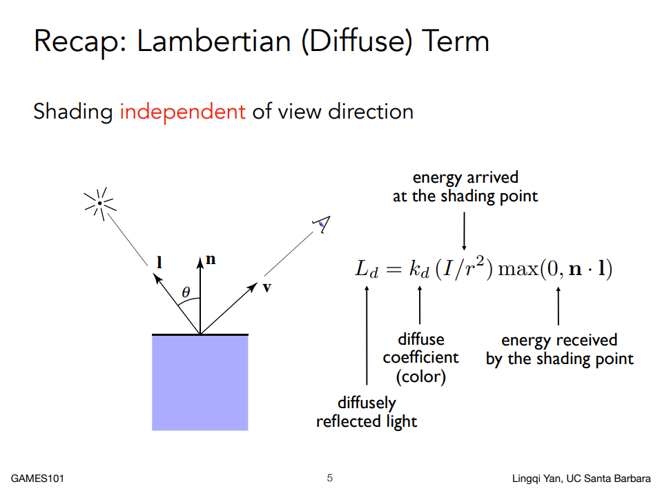
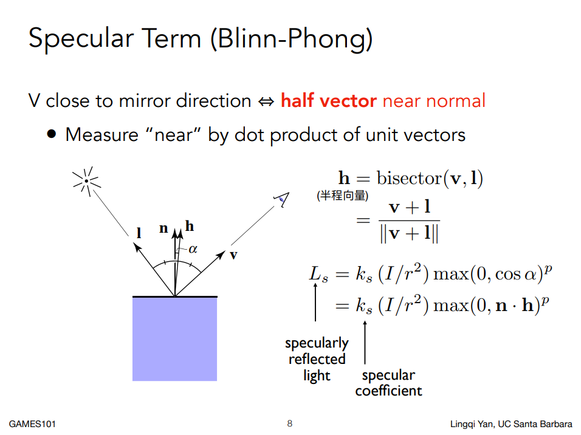
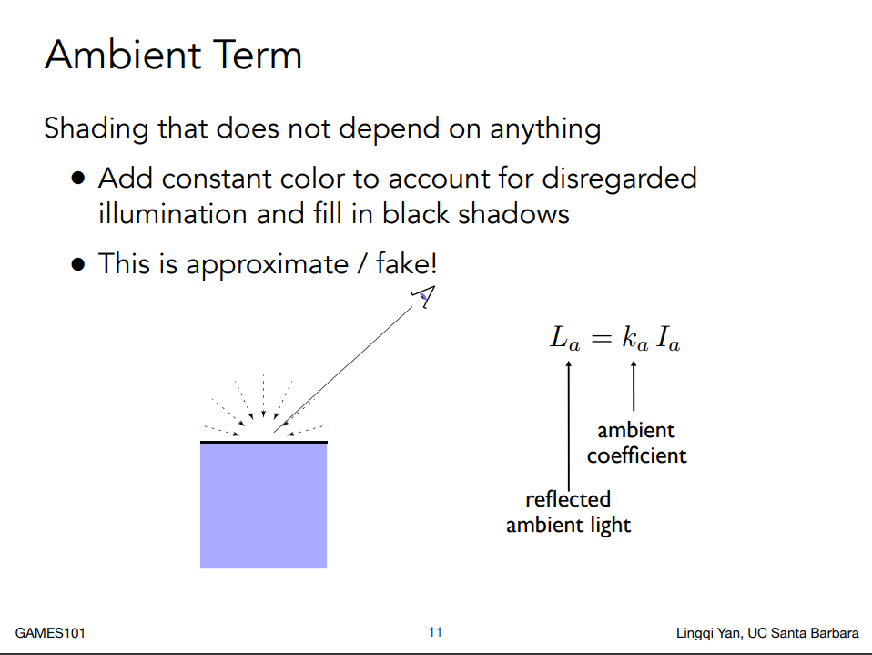

# Assignment1

- [link](http://games-cn.org/forums/topic/%e4%bd%9c%e4%b8%9a3%e6%9b%b4%e6%ad%a3%e5%85%ac%e5%91%8a/)
- [理论参考](https://zhuanlan.zhihu.com/p/419872527)

## Barycentric Coordinates & interpolate attribute
- **Barycentric Coordinates（重心坐标）**: 对triangle内的pixel进行计算重心坐标的系数`$\alpha, \beta & \gamma$`
  
  

  - C++ Code
  ```c++
  static std::tuple<float, float, float> computeBarycentric2D(float x, float y, const Vector4f* v)
  {
    float c1 = (x*(v[1].y() - v[2].y()) + (v[2].x() - v[1].x())*y + v[1].x()*v[2].y() - v[2].x()*v[1].y()) / (v[0].x()*(v[1].y() - v[2].y()) + (v[2].x() - v[1].x())*v[0].y() + v[1].x()*v[2].y() - v[2].x()*v[1].y());
    float c2 = (x*(v[2].y() - v[0].y()) + (v[0].x() - v[2].x())*y + v[2].x()*v[0].y() - v[0].x()*v[2].y()) / (v[1].x()*(v[2].y() - v[0].y()) + (v[0].x() - v[2].x())*v[1].y() + v[2].x()*v[0].y() - v[0].x()*v[2].y());
    float c3 = (x*(v[0].y() - v[1].y()) + (v[1].x() - v[0].x())*y + v[0].x()*v[1].y() - v[1].x()*v[0].y()) / (v[2].x()*(v[0].y() - v[1].y()) + (v[1].x() - v[0].x())*v[2].y() + v[0].x()*v[1].y() - v[1].x()*v[0].y());
    return {c1,c2,c3};
  }
  ```

- **interpolate attribute**: 根据`$\alpha, \beta & \gamma$`计算attribute(color & texture coordinate & normal)
  

  - C++ Code
  ```c++
  static Eigen::Vector3f interpolate(float alpha, float beta, float gamma, const Eigen::Vector3f& vert1, const Eigen::Vector3f& vert2, const Eigen::Vector3f& vert3, float weight)
  {
    return (alpha * vert1 + beta * vert2 + gamma * vert3) / weight;
  }
  ```
  
## Shading

- **Normal fragment shader **: 以vertex normal为着色依据
  - C++ Code
  ```c++
  Eigen::Vector3f normal_fragment_shader(const fragment_shader_payload& payload)
  {
    Eigen::Vector3f return_color = (payload.normal.head<3>().normalized() + Eigen::Vector3f(1.0f, 1.0f, 1.0f)) / 2.f;
    Eigen::Vector3f result;
    result << return_color.x() * 255, return_color.y() * 255, return_color.z() * 255;
    return result;
  }
  ```

- Blinn-Phong fragment shader:
  - Blinn-Phong Reflection Model
  
  
  - Diffuse Reflection
  
  - Specular
  
  - Ambient
  
  - C++ Code
  ```c++
  Eigen::Vector3f phong_fragment_shader(const fragment_shader_payload& payload)
  {
    // a -- ambient, d -- diffuse, s -- specular coefficient
    Eigen::Vector3f ka = Eigen::Vector3f(0.005, 0.005, 0.005);
    Eigen::Vector3f kd = payload.color;
    Eigen::Vector3f ks = Eigen::Vector3f(0.7937, 0.7937, 0.7937);

    // two light source
    auto l1 = light{{20, 20, 20}, {500, 500, 500}};
    auto l2 = light{{-20, 20, 0}, {500, 500, 500}};

    std::vector<light> lights = {l1, l2};
    Eigen::Vector3f amb_light_intensity{10, 10, 10}; // environment light intensity
    Eigen::Vector3f eye_pos{0, 0, 10}; // camera location

    float p = 150; // pow coefficient for specular

    Eigen::Vector3f color = payload.color;
    Eigen::Vector3f point = payload.view_pos;
    Eigen::Vector3f normal = payload.normal;

    Eigen::Vector3f result_color = {0, 0, 0};
    for (auto& light : lights)
    {
        // TODO: For each light source in the code, calculate what the *ambient*, *diffuse*, and *specular* 
        // components are. Then, accumulate that result on the *result_color* object.
        float r = (point - light.position).norm(); // the distance between light source and point
        Eigen::Vector3f l = (light.position - point).normalized(); //l -- light direction
        Eigen::Vector3f v = (eye_pos - point).normalized(); // v -- eye watch direction
        Eigen::Vector3f h = (l + v).normalized(); // h -- (l + v) / ||l + v||

        // Ld -- diffuse, Ls -- specular, La -- ambient
        Eigen::Vector3f Ld = kd.cwiseProduct(light.intensity / std::pow(r, 2)) * std::max(0.0f, normal.cwiseProduct(l).sum());
        Eigen::Vector3f Ls = ks.cwiseProduct(light.intensity / std::pow(r, 2)) * std::pow(std::max(0.0f, normal.cwiseProduct(h).sum()), p);
        Eigen::Vector3f La = ka.cwiseProduct(amb_light_intensity);

        result_color += La + Ld + Ls;
    }

    return result_color * 255.f;
  }
  ```
  
- texture fragment shader
  - 以(u, v) 对应 texture.png 的 color 代替 kd
  - C++ Code
  ```c++
   Eigen::Vector3f texture_fragment_shader(const fragment_shader_payload& payload)
   {
        Eigen::Vector3f return_color = {0, 0, 0};
        if (payload.texture)
        {
            // TODO: Get the texture value at the texture coordinates of the current fragment
            Eigen::Vector3f tex_color = payload.texture->getColor(payload.tex_coords.x(), payload.tex_coords.y());
            return_color += tex_color;
        }
        Eigen::Vector3f texture_color;
        texture_color << return_color.x(), return_color.y(), return_color.z();

        Eigen::Vector3f ka = Eigen::Vector3f(0.005, 0.005, 0.005);
        Eigen::Vector3f kd = texture_color / 255.f;
        Eigen::Vector3f ks = Eigen::Vector3f(0.7937, 0.7937, 0.7937);

        auto l1 = light{{20, 20, 20}, {500, 500, 500}};
        auto l2 = light{{-20, 20, 0}, {500, 500, 500}};

        std::vector<light> lights = {l1, l2};
        Eigen::Vector3f amb_light_intensity{10, 10, 10};
        Eigen::Vector3f eye_pos{0, 0, 10};

        float p = 150;

        Eigen::Vector3f color = texture_color;
        Eigen::Vector3f point = payload.view_pos;
        Eigen::Vector3f normal = payload.normal;

        Eigen::Vector3f result_color = {0, 0, 0};

        for (auto& light : lights)
        {
            // TODO: For each light source in the code, calculate what the *ambient*, *diffuse*, and *specular* 
            // components are. Then, accumulate that result on the *result_color* object.
            Eigen::Vector3f v = (eye_pos - point).normalized();
            Eigen::Vector3f l = (light.position - point).normalized();
            Eigen::Vector3f h = (v + l).normalized();

            float r = (light.position - point).norm();

            Eigen::Vector3f Ld = kd.cwiseProduct(light.intensity / std::pow(r, 2)) * std::max(0.0f, normal.cwiseProduct(l).sum());
            Eigen::Vector3f Ls = ks.cwiseProduct(light.intensity / std::pow(r, 2)) * std::pow(std::max(0.0f, normal.cwiseProduct(h).sum()), p);
            Eigen::Vector3f La = ka.cwiseProduct(amb_light_intensity);

            result_color += Ld + Ls + La;
        }

        return result_color * 255.f;
   }
  ```
  **注意**：u和v要clamp到[0, 1]区间，因此getColor函数需要加个限定
  ```c++
  Eigen::Vector3f getColor(float u, float v)
  {
    u = std::min(1.0f, std::max(0.0f, u));
    v = std::min(1.0f, std::max(0.0f, v));

    auto u_img = u * width;
    auto v_img = (1 - v) * height;
    auto color = image_data.at<cv::Vec3b>(v_img, u_img);
    return Eigen::Vector3f(color[0], color[1], color[2]);
  }
  ```

## rasterization
- C++ Code
  ```c++
  //Screen space rasterization
  void rst::rasterizer::rasterize_triangle(const Triangle& t, const std::array<Eigen::Vector3f, 3>& view_pos)
  {
    // [X, Y, Z] => [X, Y, Z, 1]
    auto v = t.toVector4();

    // find the bounding box, to accelerate the raster
    float x_min = v[0][0];
    float x_max = v[0][0];
    float y_min = v[0][1];
    float y_max = v[0][1];
    for(int i=1; i<v.size(); i++)
    {
        x_min = std::min(x_min, v[i][0]);
        x_max = std::max(x_max, v[i][0]);
        y_min = std::min(y_min, v[i][1]);
        y_max = std::max(y_max, v[i][1]);
    }

    int xmin = std::floor(x_min);
    int ymin = std::floor(y_min);
    int xmax = std::ceil(x_max);
    int ymax = std::ceil(y_max);

    // raster
    for(int x = xmin; x < xmax; ++ x)
    {
        for(int y = ymin; y < ymax; ++ y)
        {
            // find if it(x, y) inside triangle
            if(insideTriangle(x + 0.5, y + 0.5, &v[0]))
            {
                // baryCenter, (alpha, beta, gamma)
                auto [alpha, beta, gamma] = computeBarycentric2D(x + 0.5, y + 0.5, &v[0]);
                // Calibration depth with camera depth
                float Z = 1.0 / (alpha / v[0].w() + beta / v[1].w() + gamma / v[2].w());
                float zp = alpha * v[0].z() / v[0].w() + beta * v[1].z() / v[1].w() + gamma * v[2].z() / v[2].w();
                zp *= Z;

                // update depth buff & interpolate the attribute (color, normal, texture)
                if(zp < depth_buf[get_index(x, y)])
                {
                    depth_buf[get_index(x, y)] = zp; // update depth buff

                    auto interpolated_color = interpolate(alpha, beta, gamma, t.color[0], t.color[1], t.color[2], 1); // interpolate color
                    auto interpolated_normal = interpolate(alpha, beta, gamma, t.normal[0], t.normal[1], t.normal[2], 1).normalized(); // interpolate normal
                    auto interpolated_texcoords = interpolate(alpha, beta, gamma, t.tex_coords[0], t.tex_coords[1], t.tex_coords[2], 1); // interpolate texture
                    auto interpolated_shadingcoords = interpolate(alpha, beta, gamma, view_pos[0], view_pos[1], view_pos[2], 1);

                    // shading
                    fragment_shader_payload payload( interpolated_color, interpolated_normal.normalized(), interpolated_texcoords, texture ? &*texture : nullptr);
                    payload.view_pos = interpolated_shadingcoords;
                    // Instead of passing the triangle's color directly to the frame buffer, pass the color to the shaders first to get the final color
                    auto pixel_color = fragment_shader(payload);

                    // set pixel color
                    set_pixel(Eigen::Vector2i{x, y}, pixel_color);
                }
            }
        }
    }
  }
  ```

  


## Build & Run

```bash
cd code
mkdir build && cd build
cmake ..
make -j8
./Rasterizer
```


