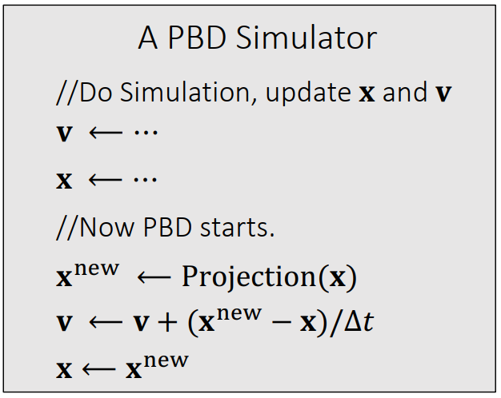

# Cloth Simulatation
## 0 Mass Spring
每条边、对边安装弹簧

## 1 Implicit Integration
- Why

    显式积分在stiffness大的时候不稳定，会overshooting.

    采用隐式积分克服这种不稳定。

- What

    1. 核心思想 - 用下一时刻的力更新当前时刻的位置x和速度v

    2. 具体方案 - 构建积分函数F(x)，用牛顿法迭代求解 x = argmin[F(x)]

- How

    1. 构建积分函数 F(x)

    2. 计算一阶导 F'(x), 二阶导 F''(x)

    3. 更新 x = x - F'(x) / F''(x)

    

## 2 Position Based Dynamic
- Why  

    显式 & 隐式积分求解在stiffness大的情况表现出不稳定 & 收敛慢问题。
    
    采用约束解决上述问题。

- What 
    
    1. 每个质点各自更新x和v.

    2. 投影阶段增加弹簧的约束 - 每根弹簧尽可能恢复原长
        
        Φ(θ) = |xi - xj| - L = 0

- How
    1. 先各自更新速度和位置
			                      
    2. 投影(以最小代价满足约束) - 计算满足约束的最近位置
    
    3. 再次更新位置和速度
    
    

- Properties
    1. 没有物理含义，从头到尾没有出现stiffness.

    2. 受迭代数目影响，迭代次数少表现的很弹，迭代次数多表现stiffness大。

    3. 受mesh分辨率影响，分辨率大需要迭代次数越多。

## 3 Strain Limiting
- Why  
    
    PBD没有物理含义，整体表现收到迭代次数和顶点个数限制，迭代次数太多导致Locking.
			       
    作为PBD补充，保证PBD的模拟**稳定**。应对大形变具有很好的性质。

- What 
    1. PBD的步骤1采用隐式积分等方法更新位置
			       
    2. 放宽约束条件 - |xi - xj|靠近原长即可 - σ_min < |xi - xj| / L < σ_max

- How  
    1. 先各自更新速度和位置(隐式积分)
 
    2. 投影 - 放宽约束计算满足约束的最近位置

    3. 再次更新位置和速度

    
    
