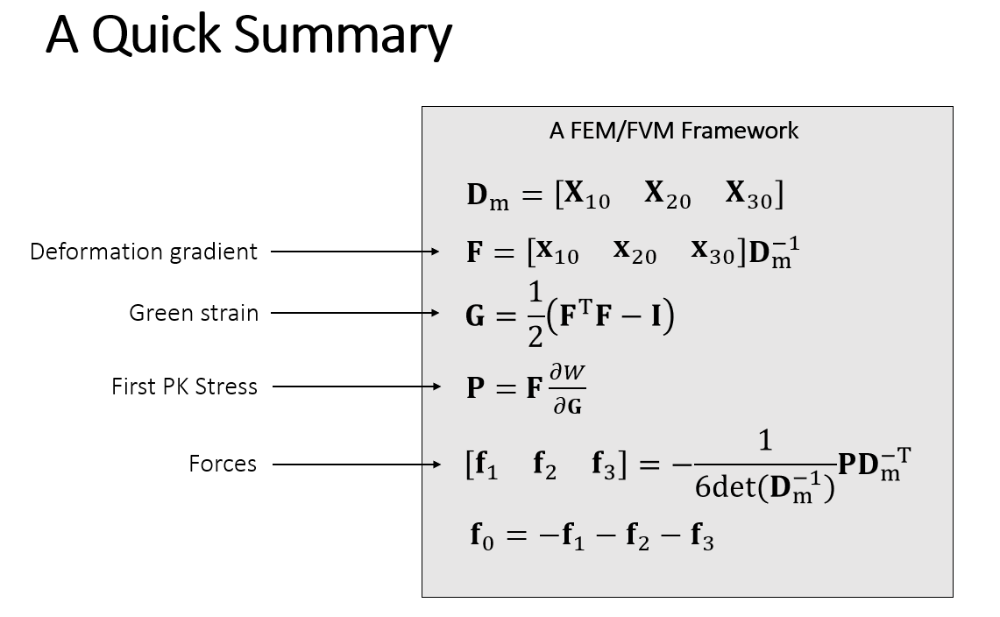
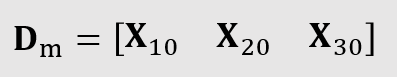
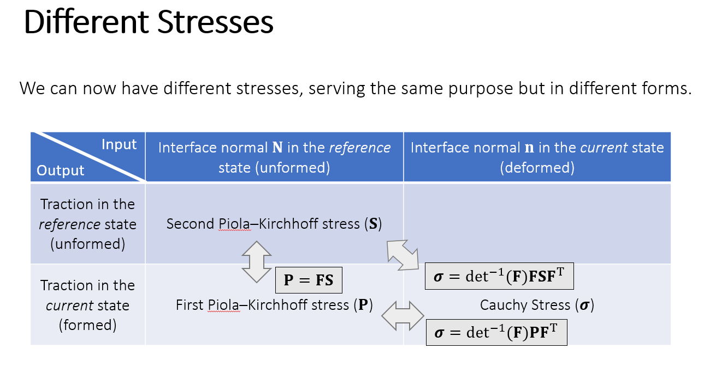
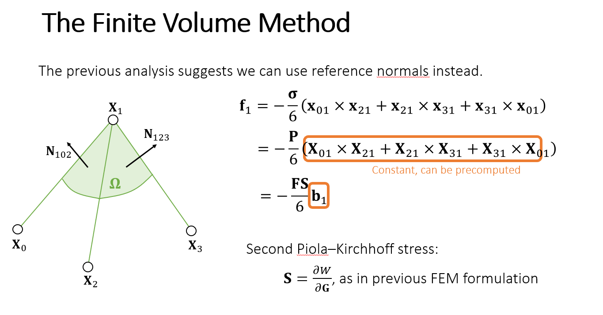
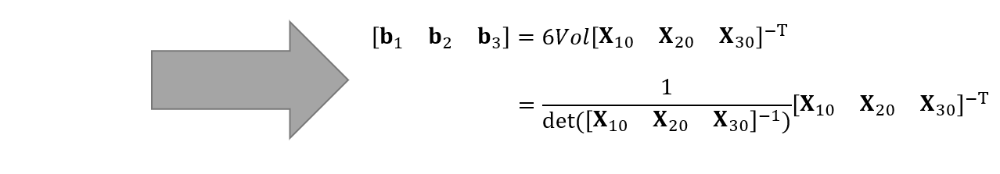
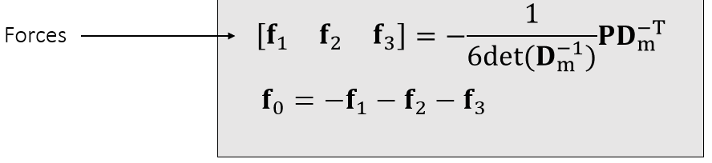

# Finite Element Method
## 0. Motivation
- What - 有限元：将**三角形/四面体**(二维-三角形/三维-四面体)当做最小计算能力和受力的单位，

- What - 假设：形变前表示$\mathbf{X}$, 形变后$\mathbf{x}$, 三角形内部形变均匀。

## 1. FEM/FVM framework
- framework:
    

## 2. Edge Matrix & Deformation gradient
- Edge Matrix

    - 没啥好说的，就是用边向量做矩阵的列。

    

    ```c#
    Matrix4x4 Build_Edge_Matrix(int tet)
    {
    	Matrix4x4 ret=Matrix4x4.zero;
    	//TODO: Need to build edge matrix here.
		Vector4 X10 = X[Tet[tet*4 + 1]] - X[Tet[tet*4 + 0]];
		Vector4 X20 = X[Tet[tet*4 + 2]] - X[Tet[tet*4 + 0]];
		Vector4 X30 = X[Tet[tet*4 + 3]] - X[Tet[tet*4 + 0]];

		ret.SetColumn(0, X10);
		ret.SetColumn(1, X20);
		ret.SetColumn(2, X30);
		ret[3, 3] = 1;

		return ret;
    }
    ```

- Deformation gradient

    - What - 描述的是形变前$\mathbf{X}$到形变后$\mathbf{x}$的变换

    $$\mathbf{x} = \mathbf{F}\mathbf{X} + c$$

    - How - 考虑边的计算，除去偏移向量$c$的影响

    $$\mathbf{x}_{10} = \mathbf{F}\mathbf{X}_{10}$$

    $$\mathbf{x}_{20} = \mathbf{F}\mathbf{X}_{20}$$

    $$\mathbf{x}_{30} = \mathbf{F}\mathbf{X}_{30}$$

    $$[\mathbf{x}_{10}, \mathbf{x}_{20}, \mathbf{x}_{30}] = \mathbf{F}[\mathbf{X}_{10}, \mathbf{X}_{20}, \mathbf{X}_{30}]$$

    求得：

    $$\mathbf{F} = [\mathbf{x}_{10}, \mathbf{x}_{20}, \mathbf{x}_{30}][\mathbf{X}_{10}, \mathbf{X}_{20}, \mathbf{X}_{30}]^{-1}$$

    ```c#
    //TODO: Need to allocate and assign inv_Dm
    inv_Dm = new Matrix4x4[tet_number];
    for (int tet = 0; tet < tet_number; tet ++)
    {
        inv_Dm[tet] = Build_Edge_Matrix(tet).inverse;
    }

    Matrix4x4 Dm_inv = inv_Dm[tet];
    //TODO: Deformation Gradient
    Matrix4x4 F = Build_Edge_Matrix(tet) * Dm_inv;
    ```

## 3. Green Strain & First PK Stress

- Green Strain

    - What - 定量描述形变能量大小的物理量

    - How - $\mathbf{G} = \frac{1}{2}(\mathbf{F}\mathbf{F}^{T} - \mathbf{I})$

    ```c#
    //TODO: Green Strain
    Matrix4x4 G = Matrix4x4MulFloat(Matrix4x4Substract(F.transpose * F, Matrix4x4.identity), 0.5f);
    ```

- First PK Stress

    - Second PK Stress

        - 解释First PK Stress前需要了解Second PK Stress，

        - What - 描述形变前法向量$\mathbf{N}$到形变前traction vector $\mathbf{T}$ (单位长度/面积上受到的力密度)的变换，不同物理建模将会对应不同的$\mathbf{S}$

        - How - $\mathbf{T} = \mathbf{S} \mathbf{N}$, 以StVK模型为例：$\mathbf{S} = 2\mu\mathbf{G} + \lambda \mathbf{Tr}(\mathbf{G})\mathbf{I}$

        ```c#
        //TODO: Second PK Stress
        Matrix4x4 S = Matrix4x4Add(Matrix4x4MulFloat(G, 2 * stiffness_1), Matrix4x4MulFloat(Matrix4x4.identity, stiffness_0 * Matrix4x4Trace(G)));
        ```
    
    - First PK Stress - $\mathbf{P}$

        - What - 与Second PK Stress关系

        

        引用知乎文章[GAMES103笔记 Lecture 7、8 有限元方法（Finite Element Method）](https://zhuanlan.zhihu.com/p/447263178)的总结

        

        - How - $\mathbf{P} = \mathbf{F} \mathbf{S}$

        ```c#
        // First PK Stress
        Matrix4x4 P = F * S;
        ```

## 4. Force & Simulation

- Force

    - What - 各顶点$\mathbf{f}$受到的力等于对其traction在其长度/面积上的积分：$\mathbf{f} = \oint_{\Omega}tdA$

    - How - 直接积分太复杂，利用之前获得的$\mathbf{P}, \mathbf{F}$进行符号简化

    

    

    

- Simulation

    - Update Velocity: $\mathbf{v}_t = \mathbf{v}_{t - 1} + \mathbf{f} / m \cdot \Delta t$

        ```c#
        //TODO: Update X and V here.
        V[i] += Force[i] / mass * dt;
        V[i] *= damp;
        ```

    - Update Position: $\mathbf{X}_t = \mathbf{X}_{t - 1} + \mathbf{v} \cdot \Delta t$

        ```c#
        // Update X
        X[i] += V[i] * dt;
        ```
    
    - Collision with floor

        ```c#
        //TODO: (Particle) collision with floor.
        if (Vector3.Dot(X[i] - floor, floor_N) < 0.0f)
        {
            if (Vector3.Dot(V[i], floor_N) < 0.0f)
            {
                Vector3 v_N = Vector3.Dot(V[i], floor_N) * floor_N; // 往墙内的速度 -- 法向速度
                Vector3 v_T = V[i] - v_N; // 切向

                Vector3 v_N_new = - restitution * v_N; // 法向分量乘上弹力系数
                float a = Math.Max(1 - friction * (1 + restitution) * v_N.magnitude / v_T.magnitude, 0.0f);
                Vector3 v_T_new = a * v_T; // 切向分量乘上摩擦系数

                Vector3 v_new = v_N_new + v_T_new; // 纠正后的碰撞后的速度
                V[i] = v_new;
                X[i] = X[i] - Vector3.Dot(X[i] - floor, floor_N) * floor_N;
            }
        }
        ```