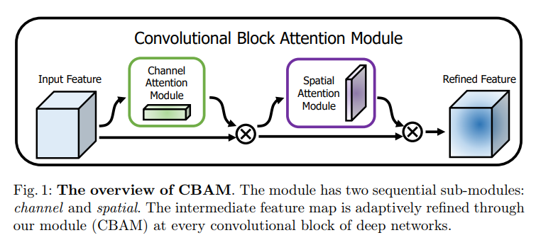
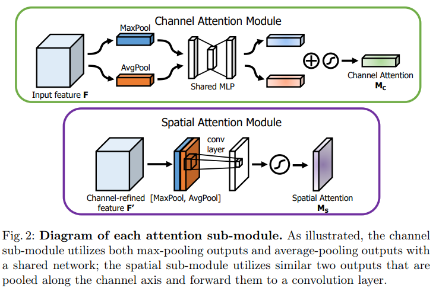

# CBAM
paper link: [CBAM](https://openaccess.thecvf.com/content_ECCV_2018/papers/Sanghyun_Woo_Convolutional_Block_Attention_ECCV_2018_paper.pdf)

## 1. Architecture



## 2. PyTorch Implementation
link: [code](./model/CBAM_module.py)

### 2.1 Channel Attention
```python
class ChannelAttention(nn.Module):
    def __init__(self, in_planes, ratio=8):
        super(ChannelAttention, self).__init__()
        self.avg_pool = nn.AdaptiveAvgPool2d(1)
        self.max_pool = nn.AdaptiveMaxPool2d(1)

        self.fc1 = nn.Conv2d(in_planes, in_planes // ratio, 1, bias=False)
        self.relu1 = nn.ReLU(inplace=True)
        self.fc2 = nn.Conv2d(in_planes // ratio, in_planes, 1, bias=False)

        self.sigmod = nn.Sigmoid()

    def forward(self, x):
        avg_out = self.fc2(self.relu1(self.fc1(self.avg_pool(x))))  # (N, 64, H, W) -> (N, 64, 1, 1) -> (N, 8, 1, 1) -> (N, 64, 1, 1)
        max_out = self.fc2(self.relu1(self.fc1(self.max_pool(x))))

        out = avg_out + max_out

        return self.sigmod(out)
```

### 2.2 Spatial Attention
```python
## step.2 Spatial Attention
class SpatialAttention(nn.Module):
    def __init__(self, kennel_size=7):
        super(SpatialAttention, self).__init__()

        assert kennel_size in (3,7), "kennel size must be 3 or 7"
        padding = 3 if kennel_size == 7 else 1

        self.conv1 = nn.Conv2d(2, 1, kennel_size, padding=padding, bias=False)
        self.sigmod = nn.Sigmoid()

    def forward(self, x):
        avg_out = torch.mean(x, dim=1, keepdim=True)
        max_out, _ = torch.max(x, dim=1, keepdim=True)

        x = torch.cat([avg_out, max_out], dim=1)
        x = self.conv1(x)

        return self.sigmod(x)
```