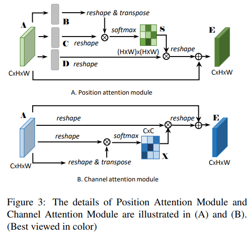

# Dual Attention
paper link: [Dual Attention](http://xxx.itp.ac.cn/pdf/1809.02983.pdf)

## 1. Architecture



## 2. PyTorch Implementation
link: [code](./model/DualAttention.py)

### 2.1 Channel Attention
```python
## step.2 channel attention
class ChannelAttentionModule(nn.Module):
    def __init__(self):
        super(ChannelAttentionModule, self).__init__()
        self.gamma = nn.Parameter(torch.zeros(1))
        self.softmax = nn.Softmax(dim=-1)

    def forward(self, x):
        N, C, H, W = x.size()
        query = x.view(N, C, -1)    # (N, C, H, W) -> (N, C, H*W)
        key = x.view(N, C, -1).permute(0, 2, 1) # (N, C, H, W) -> (N, H*W, C)

        # calculate correlation
        enery = torch.bmm(query, key)   # (N, C, C)
        enery = torch.max(enery, -1, keepdim=True)[0].expand_as(enery) - enery  # trick?
        attention = self.softmax(enery) # (N, C, C) softmax along dim=-1 C channel

        value = x.view(N, C, -1)    # (N, C, H*W)

        out = torch.bmm(attention, value)   # bmm del C(already softmax dimension)
        out = out.view(N, C, H, W)
        out = self.gamma * out + x

        return out
```

### 2.2 Position Attention
```python
## step.2 position attention
class PositionAttentionModule(nn.Module):
    def __init__(self, in_channels=64):
        super(PositionAttentionModule, self).__init__()
        self.query_conv = nn.Conv2d(in_channels, in_channels // 8, kernel_size=1)   # conv B in dual attention
        self.key_conv = nn.Conv2d(in_channels, in_channels // 8, kernel_size=1)     # conv C
        self.value_conv = nn.Conv2d(in_channels, in_channels, kernel_size=1)        # conv D

        self.gamma = nn.Parameter(torch.zeros(1))   # learnable parameter initialize from zero

        self.softmax = nn.Softmax(dim=-1)

    def forward(self, x):
        N, C, H, W = x.size()
        query = self.query_conv(x).view(N, -1, H*W).permute(0, 2, 1) # (N, C, H, W) -> (N, C', H, W) -> (N, H*W, C')
        key = self.key_conv(x).view(N, -1, H*W) # (N, C, H, W) -> (N, C', H, W) -> (N, C', H*W)

        # calculate correlation
        enery = torch.bmm(query, key)   # (N, H*W, C') bmm (N, C', H*W) -> (N, H*W, H*W)
        # spatial normalize
        attention = self.softmax(enery) # (N, H*W, H*W) softmax along spatial dimension (dim=-1, H*W)

        value = self.value_conv(x).view(N, -1, H*W) # (N, C, H, W) -> (N, C, H*W)

        # NOTE!! transpose the attention from (N, H*W, H*W) to (N, H*W, H*W), swap dim=1 <-> dim=2
        out = torch.bmm(value, attention.permute(0, 2, 1))  # (N, C, H*W) bmm (N, H*W, H*W) -> (N, C, H*W)
        out = out.view(N, C, H, W)  # (N, C, H, W)
        out = self.gamma * out + x  # gamma * out + x

        return out
```