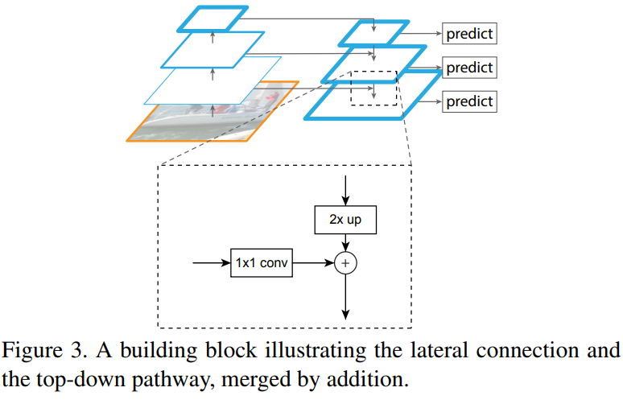

# CBAM
paper link: [FPN](http://xxx.itp.ac.cn/pdf/1612.03144v2)

## 1. Architecture


## 2. PyTorch Implementation
link: [code](./model/FPN.py)

### 2.1 FPN
```python
## step.1 FPN
class BasicModule(nn.Module):
    def __init__(self, architecture='resnet101', pretrained=True):
        super(BasicModule, self).__init__()
        ...

    def top_down(self, x):
        c1, c2, c3, c4, c5 = x

        p5 = self.relu(self.c5_conv(c5))
        p4 = self.up_conv5(F.interpolate(p5, scale_factor=2, mode='bilinear', align_corners=True)) + self.relu(self.c4_conv(c4))
        p3 = self.up_conv4(F.interpolate(p4, scale_factor=2, mode='bilinear', align_corners=True)) + self.relu(self.c3_conv(c3))
        p2 = self.up_conv3(F.interpolate(p3, scale_factor=2, mode='bilinear', align_corners=True)) + self.relu(self.c2_conv(c2))
        p1 = self.up_conv2(F.interpolate(p2, scale_factor=2, mode='bilinear', align_corners=True)) + self.relu(self.c1_conv(c1))

        p0 = F.interpolate(p1, scale_factor=2, mode='bilinear', align_corners=True)

        p0 = self.relu(self.p0_conv(p0))

        return p0, p1, p2, p3, p4, p5

    def forward(self, x):
        # bottom up
        c1, c2, c3, c4, c5 = self.backbone(x)

        # top down
        p0, p1, p2, p3, p4, p5 = self.top_down((c1, c2, c3, c4, c5))

        # output
        depth = self.pred_depth(p0)
        surface_normal = self.pred_surface_normal(p0)

        return depth, surface_normal
```

### 2.2 Initialize
```python
class ResNet(nn.Module):

    def __init__(self, block, layers, num_classes=1000):
        self.inplanes = 128
        super(ResNet, self).__init__()
        ...

        for m in self.modules():
            if isinstance(m, nn.Conv2d):
                n = m.kernel_size[0] * m.kernel_size[1] * m.out_channels
                m.weight.data.normal_(0, math.sqrt(2. / n))
            elif isinstance(m, BatchNorm2d):
                m.weight.data.fill_(1)
                m.bias.data.zero_()
```
* CNN初始化权重

    * 

* BatchNormal初始化权重
    * 
    
* CNN参数量与计算量
    * 输入：[N, in_channel, H, W], 输出：[N, out_channel, H', W']
    * 卷积核尺寸： [out_channel, in_channel, K, K]
    * 参数量： out_channel * (K * K * in_channel + 1)
    * 计算量： H' * W' * 参数量 = H' * W' * out_channel * (K * K * in_channel + 1)