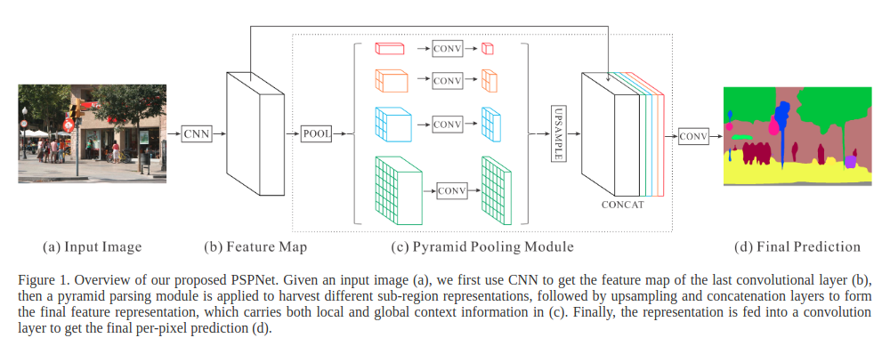
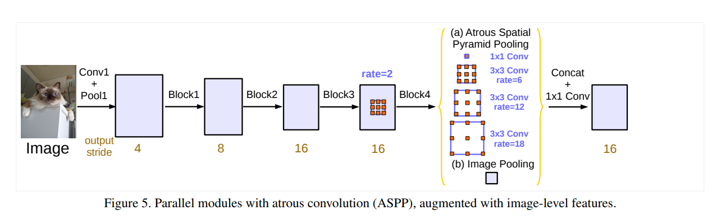

# CBAM
paper link: [PSPNet](http://xxx.itp.ac.cn/pdf/1612.01105v2), [ASPP](http://xxx.itp.ac.cn/pdf/1706.05587v3)

## 1. Architecture



## 2. PyTorch Implementation
link: [PPM](./model/PPM.py), [ASPP](./model/ASPP.py)

### 2.1 PPM
```python
class PPM(nn.Module):
    def __init__(self, in_dim, reduction_dim, bins=(1, 2, 3, 6)):
        super(PPM, self).__init__()
        self.features = []
        for bin in bins:
            self.features.append(
                nn.Sequential(
                    nn.AdaptiveAvgPool2d(bin),
                    nn.Conv2d(in_dim, reduction_dim, kernel_size=1, bias=False),
                    nn.BatchNorm2d(reduction_dim),
                    nn.ReLU(inplace=True)
                )
            )
        self.features = nn.ModuleList(self.features)

    def forward(self, x):
        x_size = x.size()   # (N, C, H, W)
        out = [x]

        for f in self.features:
            out.append(F.interpolate(f(x), x_size[2:], mode='bilinear', align_corners=True))

        return torch.cat(out, 1)
```

**NOTE:** DPSNet, NAS & z-nas中都包括了PPM模块, 见z-nas/models/submodule.py line 142
```python
class feature_extraction(nn.Module):
    def __init__(self):
        super(feature_extraction, self).__init__()
        ...
        
    def forward(self, x):
        output      = self.firstconv(x) # (B, 3, H/2, W/2)
        output      = self.layer1(output)   # (B, 32, H/2, W/2)
        output_raw  = self.layer2(output)   # (B, 64, H/4, W/4)
        output      = self.layer3(output_raw)   # (B, 128, H/4, W/4)
        output_skip = self.layer4(output)   # (B, 128, H/4, W/4)

        output_branch1 = self.branch1(output_skip)  # (B, 128, H/128, W/128)
        output_branch1 = F.interpolate(output_branch1, (output_skip.size()[2],output_skip.size()[3]),mode='bilinear', align_corners = False)    # (B, 32, H/4, W/4)

        output_branch2 = self.branch2(output_skip)  # (B, 128, H/64, W/64)
        output_branch2 = F.interpolate(output_branch2, (output_skip.size()[2],output_skip.size()[3]),mode='bilinear', align_corners = False)    # (B, 32, H/4, W/4)

        output_branch3 = self.branch3(output_skip)  # (B, 128, H/32, W/32)
        output_branch3 = F.interpolate(output_branch3, (output_skip.size()[2],output_skip.size()[3]),mode='bilinear', align_corners = False)    # (B, 32, H/4, W/4)


        output_branch4 = self.branch4(output_skip)  # (B, 128, H/16, W/16)
        output_branch4 = F.interpolate(output_branch4, (output_skip.size()[2],output_skip.size()[3]),mode='bilinear', align_corners = False)    # (B, 32, H/4, W/4)

        output_feature = torch.cat((output_raw, output_skip, output_branch4, output_branch3, output_branch2, output_branch1), 1)    # (B, 320, H/4, W/4)
        output_feature = self.lastconv(output_feature)  # (B, 32, H/4, W/4)


        return output_feature
```

### 2.2 ASPP
```python
class ASPP(nn.Module):
    def __init__(self, in_channels=512, out_channels=256):
        super(ASPP, self).__init__()
        # convolution with different Atrous dilation
        self.conv1x1_1 = nn.Sequential(
            nn.Conv2d(in_channels, in_channels // 2, kernel_size=1),
            nn.BatchNorm2d(in_channels // 2),
            nn.ReLU(inplace=True)
        )

        self.conv3x3_1 = nn.Sequential(
            nn.Conv2d(in_channels, in_channels // 2, kernel_size=3, stride=1, padding=6, dilation=6),
            nn.BatchNorm2d(in_channels // 2),
            nn.ReLU(inplace=True)
        )

        self.conv3x3_2 = nn.Sequential(
            nn.Conv2d(in_channels, in_channels // 2, kernel_size=3, stride=1, padding=12, dilation=12),
            nn.BatchNorm2d(in_channels // 2),
            nn.ReLU(inplace=True)
        )

        self.conv3x3_3 = nn.Sequential(
            nn.Conv2d(in_channels, in_channels // 2, kernel_size=3, stride=1, padding=18, dilation=18),
            nn.BatchNorm2d(in_channels // 2),
            nn.ReLU(inplace=True)
        )

        # image pooling
        self.avg_pool = nn.Sequential(
            nn.AdaptiveAvgPool2d(1),
            nn.Conv2d(in_channels, in_channels // 2, kernel_size=1),
            nn.BatchNorm2d(in_channels // 2),
            nn.ReLU(inplace=True)
        )

        # output convolution
        self.out_conv = nn.Sequential(
            nn.Conv2d((in_channels // 2) * 5, in_channels // 2, kernel_size=1),
            nn.BatchNorm2d(in_channels // 2),
            nn.ReLU(inplace=True),
            nn.Conv2d(in_channels // 2, out_channels, kernel_size=1)
        )

    def forward(self, x):
        N, C, H, W = x.size()

        # Atrous Spatial Pyramid Pooling
        out_1x1 = self.conv1x1_1(x)     # (N, C/2, H, W)
        out_3x3_1 = self.conv3x3_1(x)   # (N, C/2, H, W)
        out_3x3_2 = self.conv3x3_2(x)   # (N, C/2, H, W)
        out_3x3_3 = self.conv3x3_3(x)   # (N, C/2, H, W)
        # Image Pooling
        out_img = self.avg_pool(x)      # (N, C/2, 1, 1)
        out_img = F.interpolate(out_img, size=(H, W), mode='bilinear', align_corners=True)  # (N, C/2, H, W)

        out = torch.cat([out_1x1, out_3x3_1, out_3x3_2, out_3x3_3, out_img], dim=1) # (N, 5 * C/2, H, W)
        out = self.out_conv(out)    # (N, C, H, W)

        return out
```