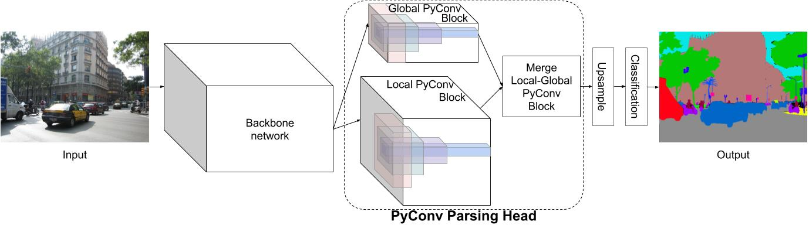

## acknowledge
code from [https://github.com/iduta/pyconvsegnet](https://github.com/iduta/pyconvsegnet)

modify for network template

## Pyramidal Convolution on semantic segmentation
This is the PyTorch implementation of paper ["Pyramidal Convolution: Rethinking Convolutional Neural Networks for Visual Recognition"](https://arxiv.org/pdf/2006.11538.pdf).
(Note that this is the code for semantic image segmentation/parsing. For image recognition on ImageNet see this repository: https://github.com/iduta/pyconv)





The models trained on ADE20K dataset can be found [here](https://drive.google.com/drive/folders/1vT-AXC06pd0ELr9PGH9jczWlgAn3istz?usp=sharing).


The results on the ADE20K validation set of our PyConvSegNet (using multi-scale inference):


| Backbone | mean IoU |pixel Acc.| |
| :----- | :-----: | :-----: |:-----: |
| ResNet-50 | 42.88% | 80.97% | ([model](https://drive.google.com/file/d/1uIliL_0ZpP20JP6cT9jwrA9nvtriS3v_/view?usp=sharing))|
| PyConvResNet-50| 43.31% | 81.18% | ([model](https://drive.google.com/file/d/1wHK9WrW2YituFg6FLOSU06bPODASdZoT/view?usp=sharing))|
| ResNet-101| 44.39% | 81.60% | ([model](https://drive.google.com/file/d/1C7NPjy0EEZajKrAAfpfOvjr_22O7JozQ/view?usp=sharing))|
| PyConvResNet-101| 44.58% | 81.77% | ([model](https://drive.google.com/file/d/1RVS_nODNQeioBYvdTPS4DYvTozMMIAlh/view?usp=sharing))|
|ResNet-152| 45.28% |81.89% | ([model](https://drive.google.com/file/d/1YoZhCOBxTGQuZkLokAd_eiaY7R0E36eE/view?usp=sharing))|
|PyConvResNet-152| 45.64% |82.36% | ([model](https://drive.google.com/file/d/1P2qJNt72bCCDEO9FeKkWY4uakFLz-Ncb/view?usp=sharing))|


Our single model top result (mIoU=39.13,  pAcc=73.91, score=56.52) on the testing set is obtained with PyConvResNet-152 as backbone and performing the training on train+val sets over 120 epochs 
 ([model](https://drive.google.com/file/d/1MdR9CeECFmMFspcYR8pbJLqo8AXEpMZz/view?usp=sharing)).


### Requirements

Install [PyTorch](https://pytorch.org/) `pip install -r requirements.txt`

A fast alternative (without the need to install PyTorch and other deep learning libraries) is to use [NVIDIA-Docker](https://docs.nvidia.com/deeplearning/frameworks/pytorch-release-notes/pullcontainer.html#pullcontainer), 
we used [this container image](https://docs.nvidia.com/deeplearning/frameworks/pytorch-release-notes/rel_19-08.html#rel_19-08).

Download the [ImageNet pretrained models](https://github.com/iduta/pyconv) and add the corresponding path to the config `.yaml` file.

Download the [ADE20K dataset](https://groups.csail.mit.edu/vision/datasets/ADE20K/). (note that this code uses label id starting from 0, while the original ids start from 1, thus, you need to preprocess the original labels by subtracting 1)


### Training and Inference
To train a model on ADE20K dataset, for instance, using PyConvResNet with 50 layers as backbone (note that you need to update the config file, for instance, `config/ade20k/pyconvresnet50_pyconvsegnet.yaml`):
```bash
./tool/train.sh ade20k pyconvresnet50_pyconvsegnet
```

Run the inference on the validation set (also update the `config/ade20k/pyconvresnet50_pyconvsegnet.yaml` file for the TEST part):
```bash
./tool/test.sh ade20k pyconvresnet50_pyconvsegnet
```

### Citation
If you find our work useful, please consider citing:
```
@article{duta2020pyramidal,
  author  = {Ionut Cosmin Duta and Li Liu and Fan Zhu and Ling Shao},
  title   = {Pyramidal Convolution: Rethinking Convolutional Neural Networks for Visual Recognition},
  journal = {arXiv preprint arXiv:2006.11538},
  year    = {2020},
}
```


### Acknowledgements
This code is based on [this repository](https://github.com/hszhao/semseg). We thank the authors for open-sourcing their code.
