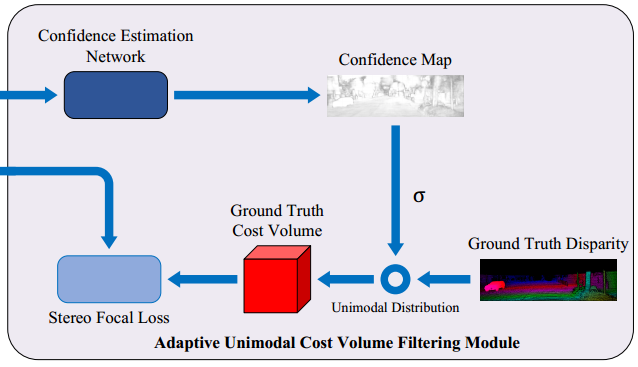

# DenseMatchingBenchmark


## acknowledge
[link](https://github.com/DeepMotionAIResearch/DenseMatchingBenchmark)

## 1. backbone
PSMNet

### 1.1 Spatial pyramid pooling module


[codeLink](https://github.com/DeepMotionAIResearch/DenseMatchingBenchmark/blob/177c56ca1952f54d28e6073afa2c16981113a2af/dmb/modeling/stereo/backbones/PSMNet.py#L83)
```python
    def _forward(self, x):
        output_2_0 = self.firstconv(x)  # (B, 3, H, W) => (B, 32, H/2, W/2)
        output_2_1 = self.layer1(output_2_0)    # (B, 32, H/2, W/2)
        output_4_0 = self.layer2(output_2_1)    # (B, 64, H/4, W/4)
        output_4_1 = self.layer3(output_4_0)    # (B, 128, H/4, W/4)
        output_8 = self.layer4(output_4_1)      # (B, 128, H/4, W/4)

        output_branch1 = self.branch1(output_8) # (B, 128, H/4, W/4) => (B, 32, 1, 2)
        output_branch1 = F.interpolate(
            output_branch1, (output_8.size()[2], output_8.size()[3]),
            mode='bilinear', align_corners=True
        )                                       # (B, 32, 1, 2) => (B, 32, H/4, W/4)

        output_branch2 = self.branch2(output_8) # (B, 128, H/4, W/4) => (B, 32, 3, 4)
        output_branch2 = F.interpolate(
            output_branch2, (output_8.size()[2], output_8.size()[3]),
            mode='bilinear', align_corners=True
        )                                       # (B, 32, 3, 4) => (B, 32, H/4, W/4)

        output_branch3 = self.branch3(output_8) # (B, 128, H/4, W/4) => (B, 32, 6, 8)
        output_branch3 = F.interpolate(
            output_branch3, (output_8.size()[2], output_8.size()[3]),
            mode='bilinear', align_corners=True
        )                                       # (B, 32, 6, 8) => (B, 32, H/4, W/4)

        output_branch4 = self.branch4(output_8) # (B, 128, H/4, W/4) => (B, 32, 12, 16)
        output_branch4 = F.interpolate(
            output_branch4, (output_8.size()[2], output_8.size()[3]),
            mode='bilinear', align_corners=True
        )                                       # (B, 32, 12, 16) => (B, 32, H/4, W/4)

        output_feature = torch.cat(
            (output_4_0, output_8, output_branch4, output_branch3, output_branch2, output_branch1), 1)  # (B, 320, H/4, W/4)
        output_feature = self.lastconv(output_feature)  # (B, 320, H/4, W/4) => (B, 32, H/4, W/4)

        return output_feature
        
    def forward(self, *input):
        if len(input) != 2:
            raise ValueError('expected input length 2 (got {} length input)'.format(len(input)))

        l_img, r_img = input

        l_fms = self._forward(l_img)    # (B, 32, H/4, W/4)
        r_fms = self._forward(r_img)    # (B, 32, H/4, W/4)

        return l_fms, r_fms
```

### 1.2 Stacked hourglass


```python
    def forward(self, x, presqu=None, postsqu=None):
        # in: [B, C, D, H, W], out: [B, 2C, D, H/2, W/2]
        out = self.conv1(x)                                         # (B, C, 48, h, w) => (B, 2C, 24, h/2, w/2) -- h = H/4, w = W/4, C = 32
        # in: [B, 2C, D, H/2, W/2], out: [B, 2C, D, H/2, W/2]
        pre = self.conv2(out)                                       # (B, 2C, 24, h/2, w/2) => (B, 2C, 24, h/2, w/2)
        if postsqu is not None:
            pre = F.relu(pre + postsqu, inplace=True)               # [(B, 2C, 24, h/2, w/2) + (B, 2C, 24, h/2, w/2)] => (B, 2C, 24, h/2, w/2)
        else:
            pre = F.relu(pre, inplace=True)

        # in: [B, 2C, D, H/2, W/2], out: [B, 2C, D, H/4, W/4]
        out = self.conv3(pre)                                       # (B, 2C, 24, h/2, w/2) => (B, 2C, 12, h/4, w/4)
        # in: [B, 2C, D, H/4, W/4], out: [B, 2C, D, H/4, W/4]
        out = self.conv4(out)                                       # (B, 2C, 12, h/4, w/4) => (B, 2C, 12, h/4, w/4)

        # in: [B, 2C, D, H/4, W/4], out: [B, 2C, D, H/2, W/2]
        if presqu is not None:
            post = F.relu(self.conv5(out) + presqu, inplace=True)   # [(B, 2C, 12, h/4, w/4) + (B, 2C, 24, h/2, w/2)] => (B, 2C, 24, h/2, w/2)
        else:
            post = F.relu(self.conv5(out) + pre, inplace=True)      # (B, 2C, 12, h/4, w/4) => (B, 2C, 24, h/2, w/2)

        # in: [B, 2C, D, H/2, W/2], out: [B, C, D, H, W]
        out = self.conv6(post)                                      # (B, 2C, 24, h/4, w/4) => (B, 2C, 48, h, w)

        return out, pre, post
```


### 1.3 cost volume
cost computation

**Concatenation**
```python
def cat_fms(reference_fm, target_fm, max_disp=192, start_disp=0, dilation=1, disp_sample=None):
    """
    Concat left and right in Channel dimension to form the raw cost volume.
    Args:
        max_disp, (int): under the scale of feature used,
            often equals to (end disp - start disp + 1), the maximum searching range of disparity
        start_disp (int): the start searching disparity index, usually be 0
            dilation (int): the step between near disparity index
        dilation (int): the step between near disparity index

    Inputs:
        reference_fm, (Tensor): reference feature, i.e. left image feature, in [BatchSize, Channel, Height, Width] layout
        target_fm, (Tensor): target feature, i.e. right image feature, in [BatchSize, Channel, Height, Width] layout

    Output:
        concat_fm, (Tensor): the formed cost volume, in [BatchSize, Channel*2, disp_sample_number, Height, Width] layout

    """
    device = reference_fm.device
    N, C, H, W = reference_fm.shape

    end_disp = start_disp + max_disp - 1
    disp_sample_number = (max_disp + dilation - 1) // dilation
    disp_index = torch.linspace(start_disp, end_disp, disp_sample_number)   # torch.arange(48) [0., 1., 2., ..., 47.]

    concat_fm = torch.zeros(N, C * 2, disp_sample_number, H, W).to(device)  # (B, 2C, 48, h, w) -- h = H/4, w = W/4
    idx = 0
    for i in disp_index:
        i = int(i) # convert torch.Tensor to int, so that it can be index
        if i > 0:
            concat_fm[:, :C, idx, :, i:] = reference_fm[:, :, :, i:]
            concat_fm[:, C:, idx, :, i:] = target_fm[:, :, :, :-i]
        elif i == 0:
            concat_fm[:, :C, idx, :, :] = reference_fm  # Concatenation along channel dimension
            concat_fm[:, C:, idx, :, :] = target_fm     # (B, 2C, 48, h, w) = Concat[(B, C, 48, h, w), (B, C, 48, h, w)]
        else:
            concat_fm[:, :C, idx, :, :i] = reference_fm[:, :, :, :i]
            concat_fm[:, C:, idx, :, :i] = target_fm[:, :, :, abs(i):]
        idx = idx + 1

    concat_fm = concat_fm.contiguous()
    return concat_fm

def forward(self, ref_fms, tgt_fms, disp_sample=None):
    # 1. build raw cost by concat
    cat_cost = self.cat_func(ref_fms, tgt_fms, disp_sample=disp_sample, **self.default_args)    # (B, 2C=64, 48, H/4, W/4)

    # 2. aggregate cost by 3D-hourglass
    costs = self.aggregator(cat_cost)   # [(B, 192, H, W), (B, 192, H, W), (B, 192, H, W)]

    return costs
```

cost aggregation

```python
def forward(self, raw_cost):
    B, C, D, H, W = raw_cost.shape  # (B, 2C, 48, h, w) -- C = 32, h = H/4, w = W/4
    # concat_fms: (BatchSize, Channels*2, MaxDisparity/4, Height/4, Width/4)
    cost0 = self.dres0(raw_cost)    # (B, 2C, 48, h, w) => (B, C, 48, h, w)
    cost0 = self.dres1(cost0) + cost0   # (B, C, 48, h, w)
    
    out1, pre1, post1 = self.dres2(cost0, None, None)   # (B, C, 48, h, w), (B, 2C, 24, h/2, w/2), (B, 2C, 24, h/2, w/2)
    out1 = out1 + cost0
    
    out2, pre2, post2 = self.dres3(out1, pre1, post1)   # (B, C, 48, h, w), (B, 2C, 24, h/2, w/2), (B, 2C, 24, h/2, w/2)
    out2 = out2 + cost0
    
    out3, pre3, post3 = self.dres4(out2, pre2, post2)   # (B, C, 48, h, w), (B, 2C, 24, h/2, w/2), (B, 2C, 24, h/2, w/2)
    out3 = out3 + cost0
    
    cost1 = self.classif1(out1)                         # (B, C, 48, h, w) => (B, 1, 48, h, w)
    cost2 = self.classif2(out2) + cost1                 # [(B, C, 48, h, w) + (B, 1, 48, h, w)] => (B, 1, 48, h, w)
    cost3 = self.classif3(out3) + cost2                 # [(B, C, 48, h, w) + (B, 1, 48, h, w)] => (B, 1, 48, h, w)
    
    # (BatchSize, 1, MaxDisparity, Height, Width)
    full_h, full_w = H * 4, W * 4
    
    cost1 = self.deconv1(cost1, [self.max_disp, full_h, full_w])    # (B, 1, 48, H/4, W/4) => (B, 1, 192, H, W)
    cost2 = self.deconv2(cost2, [self.max_disp, full_h, full_w])    # (B, 1, 192, H, W) => (B, 1, 192, H, W)
    cost3 = self.deconv3(cost3, [self.max_disp, full_h, full_w])    # (B, 1, 192, H, W) => (B, 1, 192, H, W)
    
    # (BatchSize, MaxDisparity, Height, Width)
    cost1 = torch.squeeze(cost1, 1) # (B, 1, 192, H, W) => (B, 192, H, W)
    cost2 = torch.squeeze(cost2, 1) # (B, 1, 192, H, W) => (B, 192, H, W)
    cost3 = torch.squeeze(cost3, 1) # (B, 1, 192, H, W) => (B, 192, H, W)
    
    return [cost3, cost2, cost1]
```

### 1.4 disparity regression
```python
    # compute disparity index: (1 ,1, disp_sample_number, 1, 1)
    disp_sample = torch.linspace(
        self.start_disp, self.end_disp, self.disp_sample_number
    )   # torch.arange(192) [0., 1., 2., 3., ..., 191.]
    disp_sample = disp_sample.repeat(1, 1, 1, 1, 1).permute(0, 1, 4, 2, 3).contiguous() # (1, 1, 192, 1, 1)
    self.disp_regression = nn.Conv3d(1, 1, (self.disp_sample_number, 1, 1), 1, 0, bias=False)
    
    def forward(self, cost_volume, disp_sample=None):

        # note, cost volume direct represent similarity
        # 'c' or '-c' do not affect the performance because feature-based cost volume provided flexibility.

        if cost_volume.dim() != 4:
            raise ValueError('expected 4D input (got {}D input)'
                             .format(cost_volume.dim()))

        # scale cost volume with alpha
        cost_volume = cost_volume * self.alpha  # (B, 192, H, W) * alpha

        if self.normalize:
            prob_volume = F.softmax(cost_volume, dim=1) # (B, 192, H, W) softmax along dim=1 (D=192)
        else:
            prob_volume = cost_volume

        # [B, disp_sample_number, W, H] -> [B, 1, disp_sample_number, W, H]
        prob_volume = prob_volume.unsqueeze(1)  # (B, 192, H, W) => # (B, 1, 192, H, W)

        disp_map = self.disp_regression(prob_volume)    # (B, 1, 192, H, W) => (B, 1, 1, H, W)
        # [B, 1, 1, W, H] -> [B, 1, W, H]
        disp_map = disp_map.squeeze(1)  # (B, 1, 1, H, W) => (B, 1, H, W)

        return disp_map
```

## 2. Confidence estimation

### 2.1 confidence generatation


```python
    def get_confidence(self, costs):
        assert len(self.conf_heads) == len(costs), "NUM of confidence heads({}) must be equal to NUM" \
                                                   "of cost volumes({})".format(len(self.conf_heads), len(costs))

        # for convenience to use log sigmoid when calculate loss,
        # we don't directly confidence cost to confidence by sigmoid
        conf_costs = [conf_head(cost) for cost, conf_head in zip(costs, self.conf_heads)]   # (B, 192, H, W) -> (B, 1, H, W)
        # convert to confidence
        confs = [torch.sigmoid(conf_cost) for conf_cost in conf_costs]  # sigmod([(B, 1, H, W), (B, 1, H, W), (B, 1, H, W)]) => range(0., 1.)
        # calculate variance modulated by confidence
        cost_vars = [self.alpha * (1 - conf) + self.beta for conf in confs] # alpha * (1-cost) + beta

        return confs, cost_vars, conf_costs

    def forward(self, costs, target=None):
        confs, cost_vars, conf_costs = self.get_confidence(costs)

        if self.training:
            cm_losses = self.get_loss(conf_costs, target)   # conf_cost (B, 1, H, W), target (B, 1, H, W)
            return cost_vars, cm_losses
        else:
            return cost_vars, confs
```