# DenseMatchingBenchmark
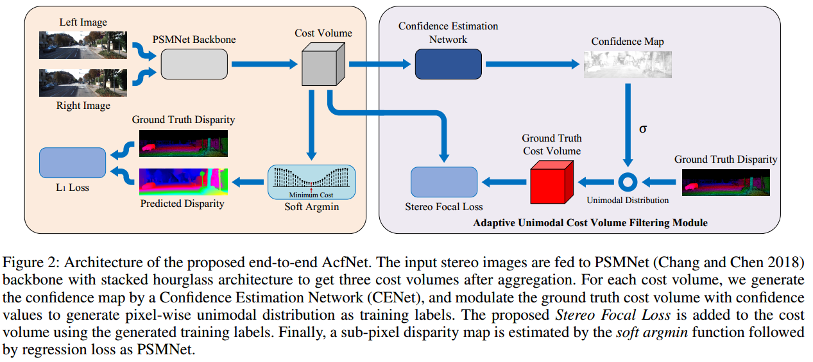

## acknowledge
[link](https://github.com/DeepMotionAIResearch/DenseMatchingBenchmark)

## 1. backbone
PSMNet

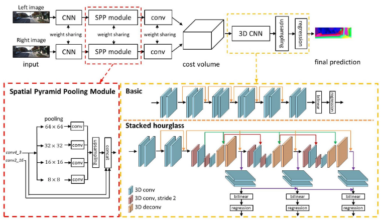
### 1.1 Spatial pyramid pooling module

[codeLink](https://github.com/DeepMotionAIResearch/DenseMatchingBenchmark/blob/177c56ca1952f54d28e6073afa2c16981113a2af/dmb/modeling/stereo/backbones/PSMNet.py#L83)
```python
def _forward(self, x):
    output_2_0 = self.firstconv(x)  # (B, 3, H, W) => (B, 32, H/2, W/2)
    output_2_1 = self.layer1(output_2_0)    # (B, 32, H/2, W/2)
    output_4_0 = self.layer2(output_2_1)    # (B, 64, H/4, W/4)
    output_4_1 = self.layer3(output_4_0)    # (B, 128, H/4, W/4)
    output_8 = self.layer4(output_4_1)      # (B, 128, H/4, W/4)

    output_branch1 = self.branch1(output_8) # (B, 128, H/4, W/4) => (B, 32, 1, 2)
    output_branch1 = F.interpolate(
        output_branch1, (output_8.size()[2], output_8.size()[3]),
        mode='bilinear', align_corners=True
    )                                       # (B, 32, 1, 2) => (B, 32, H/4, W/4)

    output_branch2 = self.branch2(output_8) # (B, 128, H/4, W/4) => (B, 32, 3, 4)
    output_branch2 = F.interpolate(
        output_branch2, (output_8.size()[2], output_8.size()[3]),
        mode='bilinear', align_corners=True
    )                                       # (B, 32, 3, 4) => (B, 32, H/4, W/4)

    output_branch3 = self.branch3(output_8) # (B, 128, H/4, W/4) => (B, 32, 6, 8)
    output_branch3 = F.interpolate(
        output_branch3, (output_8.size()[2], output_8.size()[3]),
        mode='bilinear', align_corners=True
    )                                       # (B, 32, 6, 8) => (B, 32, H/4, W/4)

    output_branch4 = self.branch4(output_8) # (B, 128, H/4, W/4) => (B, 32, 12, 16)
    output_branch4 = F.interpolate(
        output_branch4, (output_8.size()[2], output_8.size()[3]),
        mode='bilinear', align_corners=True
    )                                       # (B, 32, 12, 16) => (B, 32, H/4, W/4)

    output_feature = torch.cat(
        (output_4_0, output_8, output_branch4, output_branch3, output_branch2, output_branch1), 1)  # (B, 320, H/4, W/4)
    output_feature = self.lastconv(output_feature)  # (B, 320, H/4, W/4) => (B, 32, H/4, W/4)

    return output_feature
    
def forward(self, *input):
    if len(input) != 2:
        raise ValueError('expected input length 2 (got {} length input)'.format(len(input)))

    l_img, r_img = input

    l_fms = self._forward(l_img)    # (B, 32, H/4, W/4)
    r_fms = self._forward(r_img)    # (B, 32, H/4, W/4)

    return l_fms, r_fms
```

### 1.2 Stacked hourglass


```python
def forward(self, x, presqu=None, postsqu=None):
    # in: [B, C, D, H, W], out: [B, 2C, D, H/2, W/2]
    out = self.conv1(x)                                         # (B, C, 48, h, w) => (B, 2C, 24, h/2, w/2) -- h = H/4, w = W/4, C = 32
    # in: [B, 2C, D, H/2, W/2], out: [B, 2C, D, H/2, W/2]
    pre = self.conv2(out)                                       # (B, 2C, 24, h/2, w/2) => (B, 2C, 24, h/2, w/2)
    if postsqu is not None:
        pre = F.relu(pre + postsqu, inplace=True)               # [(B, 2C, 24, h/2, w/2) + (B, 2C, 24, h/2, w/2)] => (B, 2C, 24, h/2, w/2)
    else:
        pre = F.relu(pre, inplace=True)

    # in: [B, 2C, D, H/2, W/2], out: [B, 2C, D, H/4, W/4]
    out = self.conv3(pre)                                       # (B, 2C, 24, h/2, w/2) => (B, 2C, 12, h/4, w/4)
    # in: [B, 2C, D, H/4, W/4], out: [B, 2C, D, H/4, W/4]
    out = self.conv4(out)                                       # (B, 2C, 12, h/4, w/4) => (B, 2C, 12, h/4, w/4)

    # in: [B, 2C, D, H/4, W/4], out: [B, 2C, D, H/2, W/2]
    if presqu is not None:
        post = F.relu(self.conv5(out) + presqu, inplace=True)   # [(B, 2C, 12, h/4, w/4) + (B, 2C, 24, h/2, w/2)] => (B, 2C, 24, h/2, w/2)
    else:
        post = F.relu(self.conv5(out) + pre, inplace=True)      # (B, 2C, 12, h/4, w/4) => (B, 2C, 24, h/2, w/2)

    # in: [B, 2C, D, H/2, W/2], out: [B, C, D, H, W]
    out = self.conv6(post)                                      # (B, 2C, 24, h/4, w/4) => (B, 2C, 48, h, w)

    return out, pre, post

# concat_fms: (BatchSize, Channels*2, MaxDisparity/4, Height/4, Width/4)
cost0 = self.dres0(raw_cost)    # (B, 2C, 48, h, w) => (B, C, 48, h, w)
cost0 = self.dres1(cost0) + cost0   # (B, C, 48, h, w)

out1, pre1, post1 = self.dres2(cost0, None, None)   # (B, C, 48, h, w), (B, 2C, 24, h/2, w/2), (B, 2C, 24, h/2, w/2)
out1 = out1 + cost0

out2, pre2, post2 = self.dres3(out1, pre1, post1)   # (B, C, 48, h, w), (B, 2C, 24, h/2, w/2), (B, 2C, 24, h/2, w/2)
out2 = out2 + cost0

out3, pre3, post3 = self.dres4(out2, pre2, post2)   # (B, C, 48, h, w), (B, 2C, 24, h/2, w/2), (B, 2C, 24, h/2, w/2)
out3 = out3 + cost0
```

### 1.4 disparity regression
```python
    # compute disparity index: (1 ,1, disp_sample_number, 1, 1)
    disp_sample = torch.linspace(
        self.start_disp, self.end_disp, self.disp_sample_number
    )   # torch.arange(192) [0., 1., 2., 3., ..., 191.]
    disp_sample = disp_sample.repeat(1, 1, 1, 1, 1).permute(0, 1, 4, 2, 3).contiguous() # (1, 1, 192, 1, 1)
    self.disp_regression = nn.Conv3d(1, 1, (self.disp_sample_number, 1, 1), 1, 0, bias=False)

def forward(self, cost_volume, disp_sample=None):

    # note, cost volume direct represent similarity
    # 'c' or '-c' do not affect the performance because feature-based cost volume provided flexibility.

    if cost_volume.dim() != 4:
        raise ValueError('expected 4D input (got {}D input)'
                         .format(cost_volume.dim()))

    # scale cost volume with alpha
    cost_volume = cost_volume * self.alpha  # (B, 192, H, W) * alpha

    if self.normalize:
        prob_volume = F.softmax(cost_volume, dim=1) # (B, 192, H, W) softmax along dim=1 (D=192)
    else:
        prob_volume = cost_volume

    # [B, disp_sample_number, W, H] -> [B, 1, disp_sample_number, W, H]
    prob_volume = prob_volume.unsqueeze(1)  # (B, 192, H, W) => # (B, 1, 192, H, W)

    disp_map = self.disp_regression(prob_volume)    # (B, 1, 192, H, W) => (B, 1, 1, H, W)
    # [B, 1, 1, W, H] -> [B, 1, W, H]
    disp_map = disp_map.squeeze(1)  # (B, 1, 1, H, W) => (B, 1, H, W)

    return disp_map
```

## 2. Confidence estimation
### 2.1 confidence generatation

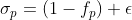

```python
def get_confidence(self, costs):
    assert len(self.conf_heads) == len(costs), "NUM of confidence heads({}) must be equal to NUM" \
                                               "of cost volumes({})".format(len(self.conf_heads), len(costs))

    # for convenience to use log sigmoid when calculate loss,
    # we don't directly confidence cost to confidence by sigmoid
    conf_costs = [conf_head(cost) for cost, conf_head in zip(costs, self.conf_heads)]   # (B, 192, H, W) -> (B, 1, H, W)
    # convert to confidence
    confs = [torch.sigmoid(conf_cost) for conf_cost in conf_costs]  # sigmod([(B, 1, H, W), (B, 1, H, W), (B, 1, H, W)]) => range(0., 1.)
    # calculate variance modulated by confidence
    cost_vars = [self.alpha * (1 - conf) + self.beta for conf in confs] # alpha * (1-cost) + beta

    return confs, cost_vars, conf_costs

def forward(self, costs, target=None):
    confs, cost_vars, conf_costs = self.get_confidence(costs)

    if self.training:
        cm_losses = self.get_loss(conf_costs, target)   # conf_cost (B, 1, H, W), target (B, 1, H, W)
        return cost_vars, cm_losses
    else:
        return cost_vars, confs
```

## 3. loss function
### 3.1 confidence loss

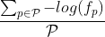

```python
# mask for valid disparity
# gt zero and lt max disparity
mask = (scaled_gtDisp > self.start_disp) & (scaled_gtDisp < (self.max_disp / scale))
valid_pixel_number = mask.float().sum()
loss = (-1.0 * F.logsigmoid(estConf) * mask).sum() / valid_pixel_number # loss_confidence Equ. 8
```

### 3.2 regression loss

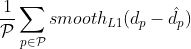

```python
loss = F.smooth_l1_loss(estDisp[mask], scaled_gtDisp[mask], reduction='mean')
```

### 3.3 focal loss
step.1 compute P(d)

.gif)

```python
cost = ((-torch.abs(self.disp_sample - self.gtDisp)) / self.variance)   # |d - d^{gt}| / sigma
probability = F.softmax(cost, dim=1)    # (B, 192, H, W) softmax along D=192 dim
```

disp_sample is d

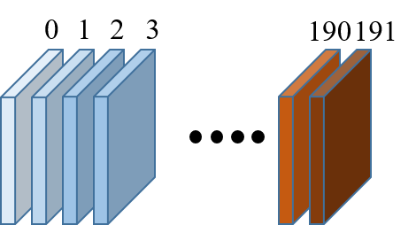

```python
self.disp_sample_number = (self.max_disp + self.dilation - 1) // self.dilation

# [disp_sample_number]
self.disp_sample = torch.linspace(
    self.start_disp, self.end_disp, self.disp_sample_number
).to(self.gtDisp.device)    # torch.arange(192)

# [BatchSize, disp_sample_number, Height, Width]
self.disp_sample = self.disp_sample.repeat(b, h, w, 1).permute(0, 3, 1, 2).contiguous() # (B, 192, H, W)
```

step.2 focal loss

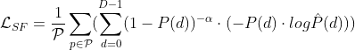

```python
valid_pixel_number = mask.float().sum()estLogProb = F.log_softmax(estCost, dim=1)  # (B, 192, H, W) along D=192 dim
weight = (1.0 - scaled_gtProb).pow(-self.focal_coefficient).type_as(scaled_gtProb)  # (1 - P_p(d)) ^ {-alpha}   # (B, 192, H, W)
loss = -((scaled_gtProb * estLogProb) * weight * mask.float()).sum() / valid_pixel_number   # focal loss Equ. 6
```

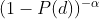

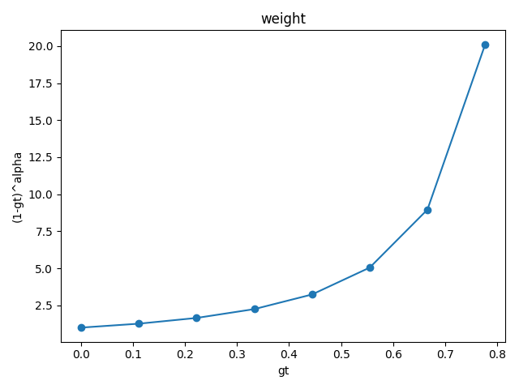

pay more **attention** to positive disparity

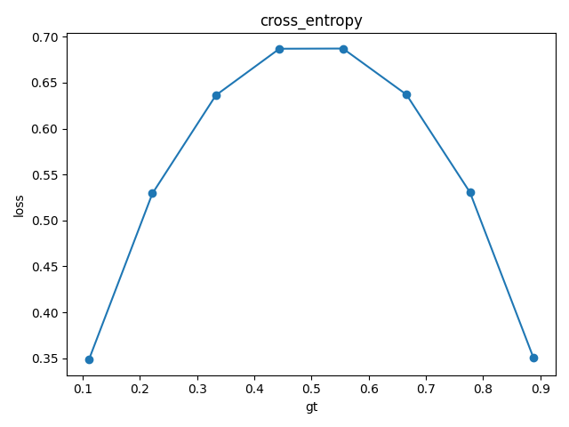
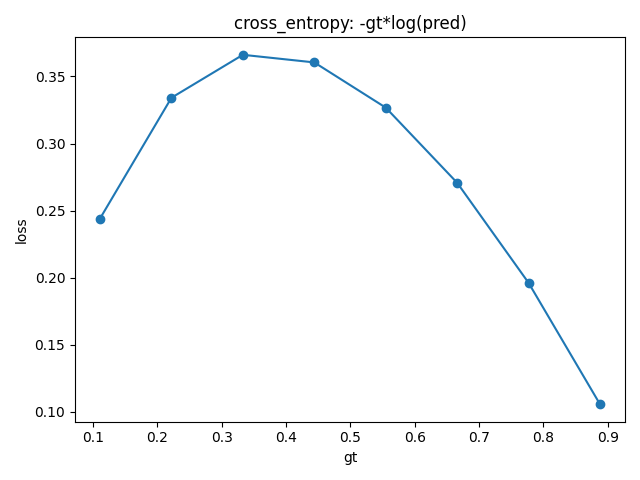
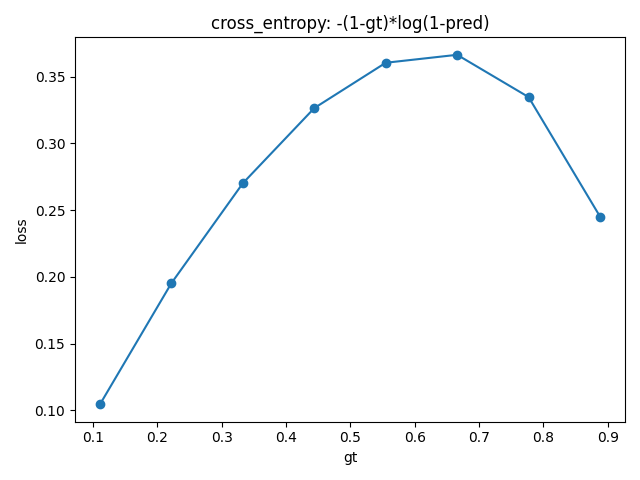
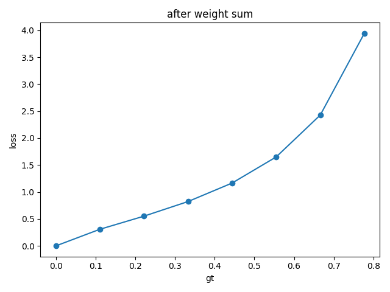
