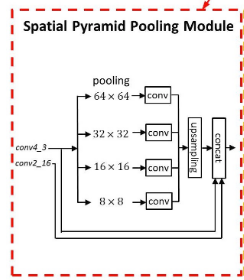
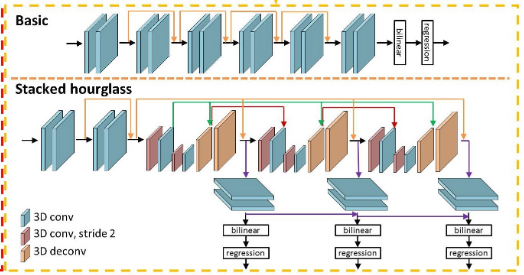
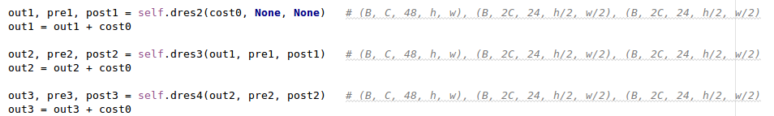

# DenseMatchingBenchmark
## acknowledge
[link](https://github.com/DeepMotionAIResearch/DenseMatchingBenchmark)

## 1. Spatial Pyramid Pooling Module



[codeLink](https://github.com/DeepMotionAIResearch/DenseMatchingBenchmark/blob/177c56ca1952f54d28e6073afa2c16981113a2af/dmb/modeling/stereo/backbones/PSMNet.py#L83)
```python
    def _forward(self, x):
        output_2_0 = self.firstconv(x)  # (B, 3, H, W) => (B, 32, H/2, W/2)
        output_2_1 = self.layer1(output_2_0)    # (B, 32, H/2, W/2)
        output_4_0 = self.layer2(output_2_1)    # (B, 64, H/4, W/4)
        output_4_1 = self.layer3(output_4_0)    # (B, 128, H/4, W/4)
        output_8 = self.layer4(output_4_1)      # (B, 128, H/4, W/4)

        output_branch1 = self.branch1(output_8) # (B, 128, H/4, W/4) => (B, 32, 1, 2)
        output_branch1 = F.interpolate(
            output_branch1, (output_8.size()[2], output_8.size()[3]),
            mode='bilinear', align_corners=True
        )                                       # (B, 32, 1, 2) => (B, 32, H/4, W/4)

        output_branch2 = self.branch2(output_8) # (B, 128, H/4, W/4) => (B, 32, 3, 4)
        output_branch2 = F.interpolate(
            output_branch2, (output_8.size()[2], output_8.size()[3]),
            mode='bilinear', align_corners=True
        )                                       # (B, 32, 3, 4) => (B, 32, H/4, W/4)

        output_branch3 = self.branch3(output_8) # (B, 128, H/4, W/4) => (B, 32, 6, 8)
        output_branch3 = F.interpolate(
            output_branch3, (output_8.size()[2], output_8.size()[3]),
            mode='bilinear', align_corners=True
        )                                       # (B, 32, 6, 8) => (B, 32, H/4, W/4)

        output_branch4 = self.branch4(output_8) # (B, 128, H/4, W/4) => (B, 32, 12, 16)
        output_branch4 = F.interpolate(
            output_branch4, (output_8.size()[2], output_8.size()[3]),
            mode='bilinear', align_corners=True
        )                                       # (B, 32, 12, 16) => (B, 32, H/4, W/4)

        output_feature = torch.cat(
            (output_4_0, output_8, output_branch4, output_branch3, output_branch2, output_branch1), 1)  # (B, 320, H/4, W/4)
        output_feature = self.lastconv(output_feature)  # (B, 320, H/4, W/4) => (B, 32, H/4, W/4)

        return output_feature
        
    def forward(self, *input):
        if len(input) != 2:
            raise ValueError('expected input length 2 (got {} length input)'.format(len(input)))

        l_img, r_img = input

        l_fms = self._forward(l_img)    # (B, 32, H/4, W/4)
        r_fms = self._forward(r_img)    # (B, 32, H/4, W/4)

        return l_fms, r_fms
```

## 2. Stacked hourglass


```python
    def forward(self, x, presqu=None, postsqu=None):
        # in: [B, C, D, H, W], out: [B, 2C, D, H/2, W/2]
        out = self.conv1(x)                                         # (B, C, 48, h, w) => (B, 2C, 24, h/2, w/2) -- h = H/4, w = W/4, C = 32
        # in: [B, 2C, D, H/2, W/2], out: [B, 2C, D, H/2, W/2]
        pre = self.conv2(out)                                       # (B, 2C, 24, h/2, w/2) => (B, 2C, 24, h/2, w/2)
        if postsqu is not None:
            pre = F.relu(pre + postsqu, inplace=True)               # [(B, 2C, 24, h/2, w/2) + (B, 2C, 24, h/2, w/2)] => (B, 2C, 24, h/2, w/2)
        else:
            pre = F.relu(pre, inplace=True)

        # in: [B, 2C, D, H/2, W/2], out: [B, 2C, D, H/4, W/4]
        out = self.conv3(pre)                                       # (B, 2C, 24, h/2, w/2) => (B, 2C, 12, h/4, w/4)
        # in: [B, 2C, D, H/4, W/4], out: [B, 2C, D, H/4, W/4]
        out = self.conv4(out)                                       # (B, 2C, 12, h/4, w/4) => (B, 2C, 12, h/4, w/4)

        # in: [B, 2C, D, H/4, W/4], out: [B, 2C, D, H/2, W/2]
        if presqu is not None:
            post = F.relu(self.conv5(out) + presqu, inplace=True)   # [(B, 2C, 12, h/4, w/4) + (B, 2C, 24, h/2, w/2)] => (B, 2C, 24, h/2, w/2)
        else:
            post = F.relu(self.conv5(out) + pre, inplace=True)      # (B, 2C, 12, h/4, w/4) => (B, 2C, 24, h/2, w/2)

        # in: [B, 2C, D, H/2, W/2], out: [B, C, D, H, W]
        out = self.conv6(post)                                      # (B, 2C, 24, h/4, w/4) => (B, 2C, 48, h, w)

        return out, pre, post
```
