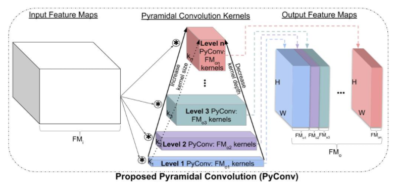
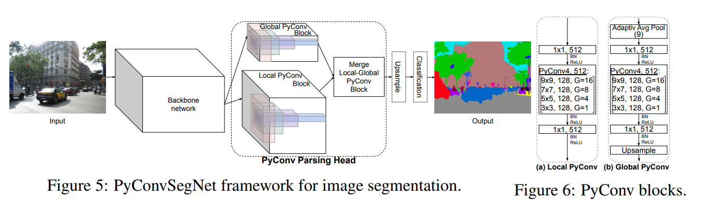

# pyconv
## 1 github url
[link](https://github.com/iduta/pyconvsegnet)

## 2 script log
### 2.1 get_parser
[yaml文件](./config/ade20k/ade20k_pyconvresnet50_pyconvsegnet.yaml)
```python
def get_parser():
    parser = argparse.ArgumentParser(description='PyTorch Semantic Segmentation')
    parser.add_argument('--config', type=str, default='config/ade20k/ade20k_pyconvresnet50_pyconvsegnet.yaml', help='config file') # 指定yaml文件
    parser.add_argument('opts', help='see config/ade20k/ade20k_pspnet50.yaml for all options', default=None, nargs=argparse.REMAINDER)
    args = parser.parse_args()
    assert args.config is not None
    cfg = config.load_cfg_from_cfg_file(args.config)
    if args.opts is not None:
        cfg = config.merge_cfg_from_list(cfg, args.opts)
    return cfg

def main():
    global args, logger
    args = get_parser() # 使用parser
    
    gray_folder = os.path.join(args.save_folder, 'gray')
```

### 2.2 get_logger
[使用解释](https://www.cnblogs.com/xianyulouie/p/11041777.html)
```python
def get_logger():
    logger_name = "main-logger"
    logger = logging.getLogger(logger_name)
    logger.setLevel(logging.INFO)
    handler = logging.StreamHandler()
    fmt = "[%(asctime)s %(levelname)s %(filename)s line %(lineno)d %(process)d] %(message)s"
    handler.setFormatter(logging.Formatter(fmt))
    logger.addHandler(handler)
    return logger

def main():
    ···
    logger = get_logger()
    logger.info(args)
    logger.info("=> creating model ...")
    logger.info("Classes: {}".format(args.classes))
    ···
```

### 2.3 魔改ResNet
#### 2.3.1 conv & conv1x1
不解释直接看代码，后面要用的
```python
def conv(in_planes, out_planes, kernel_size=3, stride=1, padding=1, dilation=1, groups=1):
    """standard convolution with padding"""
    return nn.Conv2d(in_planes, out_planes, kernel_size=kernel_size, stride=stride,
                     padding=padding, dilation=dilation, groups=groups, bias=False)


def conv1x1(in_planes, out_planes, stride=1):
    """1x1 convolution"""
    return nn.Conv2d(in_planes, out_planes, kernel_size=1, stride=stride, bias=False)
```

#### 2.3.2 build backbone_layers from ResNet
[build_backbone_layers](./model/build_backbone_layers.py)

其实是为了得到layer1, layer2, layer3, layer4
```python
def build_backbone_layers(backbone_net, layers, pretrained, backbone_output_stride=8, convert_bn=None):

    if backbone_net == 'pyconvresnet':
        if layers == 50:    # 对应ResNet50
            backbone = pyconvresnet.pyconvresnet50()
        elif layers == 101: # 对应ResNet101
            backbone = pyconvresnet.pyconvresnet101()
        elif layers == 152: # 对应ResNet152
            backbone = pyconvresnet.pyconvresnet152()

        if pretrained:
            print("Load pretrained model:  ", pretrained)
            backbone.load_state_dict(torch.load(pretrained), strict=True)
        
        # 换BatchNormal层
        if convert_bn and not isinstance(convert_bn, torch.nn.BatchNorm2d):#!!!!!!!!!!!!!!!!!!!!!!!!!!!!!!!!
            print("Converting Batch Norm to: ", convert_bn)
            backbone = convert_BN(backbone, convert_bn)

        layer0 = nn.Sequential(backbone.conv1, backbone.bn1, backbone.relu)
        layer1, layer2, layer3, layer4 = backbone.layer1, backbone.layer2, backbone.layer3, backbone.layer4
        
        # tricks? PSPNet也有这一步
        if backbone_output_stride == 8:
            for n, m in layer3.named_modules():
                if 'conv2_1' in n:
                    m.dilation, m.padding, m.stride = (2, 2), (2, 2), (1, 1)
                elif "conv2_2" in n:
                    m.dilation, m.padding, m.stride = (2, 2), (4, 4), (1, 1)
                elif 'downsample.0' in n:
                    m.stride = (1, 1)
            for n, m in layer4.named_modules():
                if 'conv2' in n:
                    m.dilation, m.padding, m.stride = (4, 4), (4, 4), (1, 1)
                elif 'downsample.0' in n:
                    m.stride = (1, 1)
        if backbone_output_stride == 16:
            for n, m in layer4.named_modules():
                if 'conv2' in n:
                    m.dilation, m.padding, m.stride = (2, 2), (2, 2), (1, 1)
                elif 'downsample.0' in n:
                    m.stride = (1, 1)

        return layer0, layer1, layer2, layer3, layer4
```

**使用**
```python
class PyConvSegNet(nn.Module):
    def __init__(self, layers=50, dropout=0.1, classes=2, zoom_factor=8,
                 criterion=nn.CrossEntropyLoss(ignore_index=255), BatchNorm=nn.BatchNorm2d, pretrained=True,
                 backbone_output_stride=16, backbone_net='resnet'):
        super(PyConvSegNet, self).__init__()
        assert layers in [50, 101, 152, 200]
        assert classes > 1
        assert zoom_factor in [1, 2, 4, 8]
        self.zoom_factor = zoom_factor
        self.criterion = criterion
        self.layer0, self.layer1, self.layer2, self.layer3, self.layer4 = build_backbone_layers(backbone_net,
                                                                                                 layers,
                                                                                                 pretrained,
                                                                                                 backbone_output_stride=backbone_output_stride,
                                                                                                 convert_bn=BatchNorm)
        backbone_output_maps = 2048
        out_merge_all = 256
        self.pyconvhead = PyConvHead(backbone_output_maps, out_merge_all, BatchNorm)

        self.aux = nn.Sequential(
            nn.Conv2d(1024, 256, kernel_size=3, padding=1, bias=False),
            BatchNorm(256),
            nn.ReLU(inplace=True),
            nn.Dropout2d(p=dropout),
            nn.Conv2d(256, classes, kernel_size=1)
        )

        self.cls = nn.Sequential(
            nn.Dropout2d(p=dropout),
            nn.Conv2d(out_merge_all, classes, kernel_size=1)
        )
    
    def forward(self, x, y=None):
        x_size = x.size()           # (2, 3, 473, 473) ----- (N, 3, H, W)
        assert (x_size[2]-1) % 8 == 0 and (x_size[3]-1) % 8 == 0
        h = int((x_size[2] - 1) / 8 * self.zoom_factor + 1) # 473
        w = int((x_size[3] - 1) / 8 * self.zoom_factor + 1) # 473

        x = self.layer0(x)          # (2, 64, 237, 237) ---- (N, 64, H/2, W/2)
        x = self.layer1(x)          # (2, 256, 119, 119) --- (N, 256, H/4, W/4)
        x = self.layer2(x)          # (2, 512, 60, 60) ----- (N, 512, H/8, H/8)
        out_stage3 = self.layer3(x) # (2, 1024, 60, 60) ---- (N, 1024, H/8, W/8)
        x = self.layer4(out_stage3) # (2, 2048, 60, 60) ---- (N, 2048, H/8, W/8)

        x = self.pyconvhead(x)  # (2, 256, 60, 60) ---- (N, 256, H/8, W/8)

        x = self.cls(x)         # (2, 150, 60, 60) ---- (N, 150, H/8, W/8)

        if self.zoom_factor != 1:
            x = F.interpolate(x, size=(h, w), mode='bilinear', align_corners=True)  # (2, 150, 473, 473) ---- (N, 150, H, W)

        if self.training:
            main_loss = self.criterion(x, y)

            aux = self.aux(out_stage3)
            if self.zoom_factor != 1:
                aux = F.interpolate(aux, size=(h, w), mode='bilinear', align_corners=True)
                aux_loss = self.criterion(aux, y)

            return x.max(1)[1], main_loss, aux_loss

        else:
            return x
```

#### 2.3.3 pyconvresnet50
[pyconvresnet50](./model/backbones/pyconvresnet.py) line 277
```python
def pyconvresnet50(pretrained=False, **kwargs):
    """Constructs a PyConvResNet-50 model.

    Args:
        pretrained (bool): If True, returns a model pre-trained on ImageNet
    """
    model = PyConvResNet(PyConvBlock, [3, 4, 6, 3], **kwargs)   # 魔改的ResNet
    if pretrained:
        os.makedirs(default_cache_path, exist_ok=True)
        model.load_state_dict(torch.load(download_from_url(model_urls['pyconvresnet50'],
                                                           root=default_cache_path)))
    return model
```

**对比**原始[resnet50](https://github.com/hszhao/semseg/blob/4f274c3f276778228bc14a4565822d46359f0cc8/model/resnet.py#L190)
```python
def resnet50(pretrained=False, **kwargs):
    """Constructs a ResNet-50 model.
    Args:
        pretrained (bool): If True, returns a model pre-trained on ImageNet
    """
    model = ResNet(Bottleneck, [3, 4, 6, 3], **kwargs)
    if pretrained:
        # model.load_state_dict(model_zoo.load_url(model_urls['resnet50']))
        model_path = './initmodel/resnet50_v2.pth'
        model.load_state_dict(torch.load(model_path), strict=False)
    return model
```

#### 2.3.4 PyConvResNet
[PyConvResNet](./model/backbones/pyconvresnet.py) line 182  -- 对应于ResNet的Class ResNet(nn.Module)
```python
class PyConvResNet(nn.Module):

    def __init__(self, block, layers, num_classes=1000, zero_init_residual=False, norm_layer=None, dropout_prob0=0.0):
        super(PyConvResNet, self).__init__()
        if norm_layer is None:
            norm_layer = nn.BatchNorm2d # 统一batchnormal
        
        # layer0 初始conv1(3, 64, 7, 2, 3)
        self.inplanes = 64
        self.conv1 = nn.Conv2d(3, 64, kernel_size=7, stride=2, padding=3, bias=False)
        self.bn1 = norm_layer(64)
        self.relu = nn.ReLU(inplace=True)
        
        # 4个瓶颈层
        self.layer1 = self._make_layer(block, 64, layers[0], stride=2, norm_layer=norm_layer,
                                       pyconv_kernels=[3, 5, 7, 9], pyconv_groups=[1, 4, 8, 16])
        self.layer2 = self._make_layer(block, 128, layers[1], stride=2, norm_layer=norm_layer,
                                       pyconv_kernels=[3, 5, 7], pyconv_groups=[1, 4, 8])
        self.layer3 = self._make_layer(block, 256, layers[2], stride=2, norm_layer=norm_layer,
                                       pyconv_kernels=[3, 5], pyconv_groups=[1, 4])
        self.layer4 = self._make_layer(block, 512, layers[3], stride=2, norm_layer=norm_layer,
                                       pyconv_kernels=[3], pyconv_groups=[1])
        # 全局池化,做分割不需要
        self.avgpool = nn.AdaptiveAvgPool2d((1, 1))
        
        # dropout,做分割不需要
        if dropout_prob0 > 0.0:
            self.dp = nn.Dropout(dropout_prob0, inplace=True)
            print("Using Dropout with the prob to set to 0 of: ", dropout_prob0)
        else:
            self.dp = None
        
        # 全连接层,做分割不需要
        self.fc = nn.Linear(512 * block.expansion, num_classes)
        
        # 凯明初始化 和 batchnormal初始化
        for m in self.modules():
            if isinstance(m, nn.Conv2d):
                nn.init.kaiming_normal_(m.weight, mode='fan_out', nonlinearity='relu')
            elif isinstance(m, (nn.BatchNorm2d, nn.GroupNorm)):
                nn.init.constant_(m.weight, 1)
                nn.init.constant_(m.bias, 0)

        # Zero-initialize the last BN in each residual branch,
        # so that the residual branch starts with zeros, and each residual block behaves like an identity.
        # This improves the model by 0.2~0.3% according to https://arxiv.org/abs/1706.02677
        if zero_init_residual:
            for m in self.modules():
                if isinstance(m, PyConvBlock):
                    nn.init.constant_(m.bn3.weight, 0)
    
    # 构建瓶颈处
    def _make_layer(self, block, planes, blocks, stride=1, norm_layer=None, pyconv_kernels=[3], pyconv_groups=[1]):
        if norm_layer is None:
            norm_layer = nn.BatchNorm2d
        # 下采样,针对每个layer开头下采样
        downsample = None
        if stride != 1 and self.inplanes != planes * block.expansion:
            downsample = nn.Sequential(
                nn.MaxPool2d(kernel_size=3, stride=stride, padding=1),
                conv1x1(self.inplanes, planes * block.expansion),
                norm_layer(planes * block.expansion),
            )
        elif self.inplanes != planes * block.expansion:
            downsample = nn.Sequential(
                conv1x1(self.inplanes, planes * block.expansion),
                norm_layer(planes * block.expansion),
            )
        elif stride != 1:
            downsample = nn.MaxPool2d(kernel_size=3, stride=stride, padding=1)
        
        # 重复PyConvBlock, block就是PyConvBlock
        layers = []
        # 第一个瓶颈层downsample一下,特殊处理
        layers.append(block(self.inplanes, planes, stride=stride, downsample=downsample, norm_layer=norm_layer,
                            pyconv_kernels=pyconv_kernels, pyconv_groups=pyconv_groups))
        self.inplanes = planes * block.expansion

        for _ in range(1, blocks):
            layers.append(block(self.inplanes, planes, norm_layer=norm_layer,
                                pyconv_kernels=pyconv_kernels, pyconv_groups=pyconv_groups))

        return nn.Sequential(*layers)

    def forward(self, x):
        # NOTE #
        # 语义分割此forward用不到
        x = self.conv1(x)
        x = self.bn1(x)
        x = self.relu(x)

        x = self.layer1(x)
        x = self.layer2(x)
        x = self.layer3(x)
        x = self.layer4(x)

        x = self.avgpool(x)
        x = x.view(x.size(0), -1)

        if self.dp is not None:
            x = self.dp(x)

        x = self.fc(x)

        return x
```

#### 2.3.5 PyConvBlock
[PyConvBlock](./model/backbones/pyconvresnet.py) line 140  -- 对应于 class Bottleneck(nn.Module):
```python
class PyConvBlock(nn.Module):
    expansion = 4

    def __init__(self, inplanes, planes, stride=1, downsample=None, norm_layer=None, pyconv_groups=1, pyconv_kernels=1):
        super(PyConvBlock, self).__init__()
        if norm_layer is None:
            norm_layer = nn.BatchNorm2d # 统一BatchNorm2d层
        # Both self.conv2 and self.downsample layers downsample the input when stride != 1
        self.conv1 = conv1x1(inplanes, planes)  # conv(inplanes=64, outplanes=64)
        self.bn1 = norm_layer(planes)
        # self.conv2 是 Pyramid conv 的核心
        self.conv2 = get_pyconv(planes, planes, pyconv_kernels=pyconv_kernels, stride=stride,
                                pyconv_groups=pyconv_groups)
        self.bn2 = norm_layer(planes)
        self.conv3 = conv1x1(planes, planes * self.expansion)
        self.bn3 = norm_layer(planes * self.expansion)
        self.relu = nn.ReLU(inplace=True)
        self.downsample = downsample
        self.stride = stride

    def forward(self, x):
        identity = x    # (N, C, h, w)

        out = self.conv1(x)     # (N, C, h, w)
        out = self.bn1(out)     # (N, C, h, w)
        out = self.relu(out)    # (N, C, h, w)

        out = self.conv2(out)   # (N, C, h/2, w/2)
        out = self.bn2(out)     # (N, C, h/2, w/2)
        out = self.relu(out)    # (N, C, h/2, w/2)

        out = self.conv3(out)   # (N, 4*C, h/2, w/2)
        out = self.bn3(out)     # (N, 4*C, h/2, w/2)

        if self.downsample is not None:
            identity = self.downsample(x)   # (N, 4*C, h/2, w/2)

        out += identity         # (N, 4*C, h/2, w/2)
        out = self.relu(out)    # (N, 4*C, h/2, w/2)

        return out
```

#### 2.3.6 get_pyconv & PyConv4

```python
class PyConv3(nn.Module):

    def __init__(self, inplans, planes,  pyconv_kernels=[3, 5, 7], stride=1, pyconv_groups=[1, 4, 8]):
        super(PyConv3, self).__init__()
        self.conv2_1 = conv(inplans, planes // 4, kernel_size=pyconv_kernels[0], padding=pyconv_kernels[0] // 2,
                            stride=stride, groups=pyconv_groups[0]) # conv(128, 32, kernel_size=3, padding=1, stride=2, groups=1)
        self.conv2_2 = conv(inplans, planes // 4, kernel_size=pyconv_kernels[1], padding=pyconv_kernels[1] // 2,
                            stride=stride, groups=pyconv_groups[1]) # conv(128, 32, kernel_size=5, padding=2, stride=2, groups=4)
        self.conv2_3 = conv(inplans, planes // 2, kernel_size=pyconv_kernels[2], padding=pyconv_kernels[2] // 2,
                            stride=stride, groups=pyconv_groups[2]) # conv(128, 64, kernel_size=7, padding=3, stride=2, groups=8)

    def forward(self, x):
        return torch.cat((self.conv2_1(x), self.conv2_2(x), self.conv2_3(x)), dim=1)

class PyConv4(nn.Module):

    def __init__(self, inplans, planes, pyconv_kernels=[3, 5, 7, 9], stride=1, pyconv_groups=[1, 4, 8, 16]):
        super(PyConv4, self).__init__()
        self.conv2_1 = conv(inplans, planes//4, kernel_size=pyconv_kernels[0], padding=pyconv_kernels[0]//2,
                            stride=stride, groups=pyconv_groups[0]) # conv(64, 16, kernel_size=3, padding=1, stride=2, groups=1)
        self.conv2_2 = conv(inplans, planes//4, kernel_size=pyconv_kernels[1], padding=pyconv_kernels[1]//2,
                            stride=stride, groups=pyconv_groups[1]) # conv(64, 16, kernel_size=5, padding=2, stride=2, groups=4)
        self.conv2_3 = conv(inplans, planes//4, kernel_size=pyconv_kernels[2], padding=pyconv_kernels[2]//2,
                            stride=stride, groups=pyconv_groups[2]) # conv(64, 16, kernel_size=7, padding=3, stride=2, groups=8)
        self.conv2_4 = conv(inplans, planes//4, kernel_size=pyconv_kernels[3], padding=pyconv_kernels[3]//2,
                            stride=stride, groups=pyconv_groups[3]) # conv(64, 16, kernel_size=9, padding=4, stride=2, groups=16)

    def forward(self, x):
        return torch.cat((self.conv2_1(x), self.conv2_2(x), self.conv2_3(x), self.conv2_4(x)), dim=1)

def get_pyconv(inplans, planes, pyconv_kernels, stride=1, pyconv_groups=[1]):
    # 不同瓶颈层,不同的数目的level的pyramid conv
    # 比如, _make_layer1 对应4 levels的 PyConv4
    if len(pyconv_kernels) == 1:
        return conv(inplans, planes, kernel_size=pyconv_kernels[0], stride=stride, groups=pyconv_groups[0])
    elif len(pyconv_kernels) == 2:
        return PyConv2(inplans, planes, pyconv_kernels=pyconv_kernels, stride=stride, pyconv_groups=pyconv_groups)
    elif len(pyconv_kernels) == 3:
        return PyConv3(inplans, planes, pyconv_kernels=pyconv_kernels, stride=stride, pyconv_groups=pyconv_groups)
    elif len(pyconv_kernels) == 4:
        return PyConv4(inplans, planes, pyconv_kernels=pyconv_kernels, stride=stride, pyconv_groups=pyconv_groups)
```

### 2.4 PyConvHead
PyConvHead 用于图像**分割**


```python
class GlobalPyConvBlock(nn.Module):
    def __init__(self, in_dim, reduction_dim, bins, BatchNorm):
        super(GlobalPyConvBlock, self).__init__()
        self.features = nn.Sequential(
                nn.AdaptiveAvgPool2d(bins), # average pooling to 9x9
                nn.Conv2d(in_dim, reduction_dim, kernel_size=1, bias=False),    # conv(2048, 512, kernel_size=1)
                BatchNorm(reduction_dim),
                nn.ReLU(inplace=True),
                PyConv4(reduction_dim, reduction_dim),  # pyramid 4 levels convolution
                BatchNorm(reduction_dim),
                nn.ReLU(inplace=True),
                nn.Conv2d(reduction_dim, reduction_dim, kernel_size=1, bias=False),
                BatchNorm(reduction_dim),
                nn.ReLU(inplace=True)
        )

    def forward(self, x):
        x_size = x.size()   # (2, 2048, 60, 60) ---- (N, 2048, H/8, W/8)
        # 上采样回去
        # self.features(x) ---- (2, 512, 9, 9)
        x = F.interpolate(self.features(x), x_size[2:], mode='bilinear', align_corners=True)    # (2, 512, 60, 60) ---- (N, 512, H/8, W/8)
        return x


class LocalPyConvBlock(nn.Module):
    def __init__(self, inplanes, planes, BatchNorm, reduction1=4):
        super(LocalPyConvBlock, self).__init__()
        self.layers = nn.Sequential(
            nn.Conv2d(inplanes, inplanes//reduction1, kernel_size=1, bias=False), # conv(2048, 512, kernel_size=1)
            BatchNorm(inplanes // reduction1),
            nn.ReLU(inplace=True),
            PyConv4(inplanes // reduction1, inplanes // reduction1),    # pyramid 4 levels convolution
            BatchNorm(inplanes // reduction1),
            nn.ReLU(inplace=True),
            nn.Conv2d(inplanes // reduction1, planes, kernel_size=1, bias=False),
            BatchNorm(planes),
            nn.ReLU(inplace=True),

        )

    def forward(self, x):
        return self.layers(x)   # (2, 512, 60, 60)  ---- (N, 512, H/8, W/8)


class MergeLocalGlobal(nn.Module):
    def __init__(self, inplanes, planes, BatchNorm):
        super(MergeLocalGlobal, self).__init__()

        self.features = nn.Sequential(
            nn.Conv2d(inplanes, planes,  kernel_size=3, padding=1, groups=1, bias=False),
            BatchNorm(planes),
            nn.ReLU(inplace=True)
        )

    def forward(self, local_context, global_context):
        x = torch.cat((local_context, global_context), dim=1)   # (2, 1024, 60, 60) ---- (N, 1024, H/8, W/8)
        x = self.features(x)    # (2, 256, 60, 60) ---- (N, 256, H/8, W/8)
        return x


class PyConvHead(nn.Module):
    def __init__(self, inplanes, planes, BatchNorm):
        super(PyConvHead, self).__init__()

        out_size_local_context = 512
        out_size_global_context = 512

        self.local_context = LocalPyConvBlock(inplanes, out_size_local_context, BatchNorm, reduction1=4)
        self.global_context = GlobalPyConvBlock(inplanes, out_size_global_context, 9, BatchNorm)

        self.merge_context = MergeLocalGlobal(out_size_local_context + out_size_global_context, planes, BatchNorm)

    def forward(self, x):
        x = self.merge_context(self.local_context(x), self.global_context(x))   # (2, 256, 60, 60) ---- (N, 256, H/8, W/8)
        return x
```

### 2.5 cv2.copyMakeBorder
[博客解释](https://blog.csdn.net/qq_36560894/article/details/105416273)

```python
image = cv2.copyMakeBorder(image, pad_h_half, pad_h - pad_h_half, pad_w_half, pad_w - pad_w_half, cv2.BORDER_CONSTANT, value=mean)
```