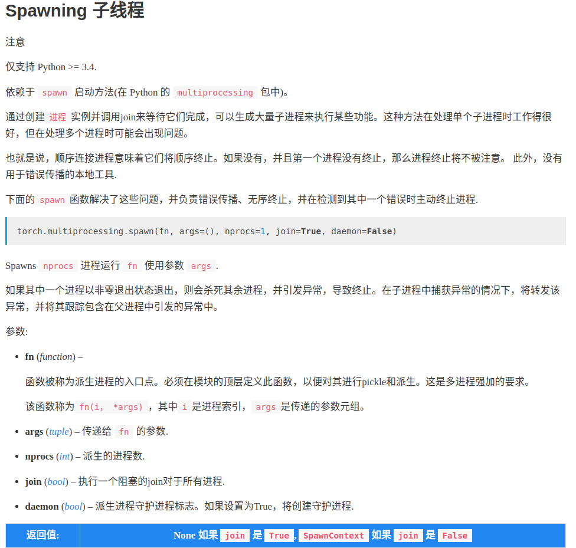

# semseg
## acknowledge
code from [semseg](https://github.com/hszhao/semseg)

## 1 get_parser
[yaml文件](./config/ade20k/ade20k_psanet50.yaml)
```python
def get_parser():
    parser = argparse.ArgumentParser(description='PyTorch Semantic Segmentation')
    parser.add_argument('--config', type=str, default='config/ade20k/ade20k_pyconvresnet50_pyconvsegnet.yaml', help='config file') # 指定yaml文件
    parser.add_argument('opts', help='see config/ade20k/ade20k_pspnet50.yaml for all options', default=None, nargs=argparse.REMAINDER)
    args = parser.parse_args()
    assert args.config is not None
    cfg = config.load_cfg_from_cfg_file(args.config)
    if args.opts is not None:
        cfg = config.merge_cfg_from_list(cfg, args.opts)
    return cfg

def main():
    global args, logger
    args = get_parser() # 使用parser
    
    gray_folder = os.path.join(args.save_folder, 'gray')
```

## 2 get_logger
[使用解释](https://www.cnblogs.com/xianyulouie/p/11041777.html)
```python
def get_logger():
    logger_name = "main-logger"
    logger = logging.getLogger(logger_name)
    logger.setLevel(logging.INFO)
    handler = logging.StreamHandler()
    fmt = "[%(asctime)s %(levelname)s %(filename)s line %(lineno)d %(process)d] %(message)s"
    handler.setFormatter(logging.Formatter(fmt))
    logger.addHandler(handler)
    return logger

def main():
    ···
    logger = get_logger()
    logger.info(args)
    logger.info("=> creating model ...")
    logger.info("Classes: {}".format(args.classes))
    ···
```

## 3 test.sh
[test.sh](tool/test.sh)
```dockerfile
#!/bin/sh

## uncomment for slurm
##SBATCH -p gpu
##SBATCH --gres=gpu:1
##SBATCH -c 10

export PYTHONPATH=./
eval "$(conda shell.bash hook)"
conda activate pt140  # pytorch 1.4.0 env
PYTHON=python

dataset=$1
exp_name=$2
exp_dir=exp/${dataset}/${exp_name}
result_dir=${exp_dir}/result
config=config/${dataset}/${dataset}_${exp_name}.yaml
now=$(date +"%Y%m%d_%H%M%S")

mkdir -p ${result_dir}
cp tool/test.sh tool/test.py ${config} ${exp_dir}

export PYTHONPATH=./
$PYTHON -u ${exp_dir}/test.py \
  --config=${config} \
  2>&1 | tee ${result_dir}/test-$now.log

```
**使用**
```dockerfile
./tool/test.sh ade20k pyconvresnet50_pyconvsegnet
```

## 4 多线程处理

```python
mp.spawn(main_worker, nprocs=args.ngpus_per_node, args=(args.ngpus_per_node, args))
```

## 5. pytorch自带的syn_bn: torch.nn.SyncBatchNorm
```python
if args.sync_bn:
    model = nn.SyncBatchNorm.convert_sync_batchnorm(model)
```

## 6. 分布式+多线程
具体要看[代码](tool/train.py), 比较复杂, 不是一两行代码讲的清楚
```python
def main_process():
    return not args.multiprocessing_distributed or (args.multiprocessing_distributed and args.rank % args.ngpus_per_node == 0)

def main():
    if main_process():
        global logger, writer
        logger = get_logger()
        writer = SummaryWriter(args.save_path)
        logger.info(args)
        logger.info("=> creating model ...")
        logger.info("Classes: {}".format(args.classes))
        logger.info(model)
    if args.distributed:
        torch.cuda.set_device(gpu)
        args.batch_size = int(args.batch_size / ngpus_per_node)
        args.batch_size_val = int(args.batch_size_val / ngpus_per_node)
        args.workers = int((args.workers + ngpus_per_node - 1) / ngpus_per_node)
        model = torch.nn.parallel.DistributedDataParallel(model.cuda(), device_ids=[gpu])
    else:
        model = torch.nn.DataParallel(model.cuda())
```