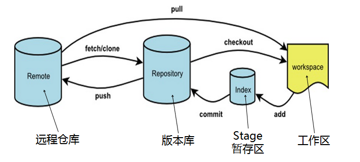

# git使用
## 1. git管理图
<br>
图来自[Git 学习笔记 - git reset 详解](https://zhouhao.me/2017/08/27/detailed-explanation-of-git-reset/)

- **git fetch** <br>
  从远程仓库(remote repository)拉取**最新**的分支, 但不与本地分支进行合并(merge).<br>
  这篇文章解释挺好[Git：远程分支----git fetch命令的使用](https://blog.csdn.net/qq_42780289/article/details/98049574)<br>
  与远程同步命令
  ```bash
  git fetch origin master  # 从远程的origin/master分支拉取到本地
  git fetch origin master:test  # 从远程的origin/master分支拉取到本地, 并新建一个test分支
  ```
  如果还想手动合并到本地master分支上<br>
  ```bash
  git chekout master # 切到master分支
  git merge origin/master # 手动合并origin/master分支
  git merge test # 手动合并test分支
  git branch -d test # 手动删除test分支 
  ```

- **git pull** <br>
  从远程仓库(remote repository)拉取**最新**的分支同时进行与本地分支**合并**(merge).<br>
  也就是: ```git pull = git fetch + git merge``` <br>
  ```bash
  git pull <远程主机名> <远程分支名>:<本地分支名>
  ```
  如将远程主机origin/master分支拉取过来，与本地的test分支合并<br>
  ```bash
  git pull origin master:test # 将远程主机origin/master分支拉取过来，与本地的test分支合并
  ```
  如果将冒号和后面的test去掉，表示将远程origin/master分支拉取下来与本地master分支合并。<br>
  git pull相当于git fetch<br>
  ```bash
  git fetch origin master # 将远程主机origin/master分支拉取过来并新建到test分支
  git chekout master # 切到master分支
  git merge origin/master # 手动合并origin/master分支到master上
  ```
  
- **git clone**<br>
  git clone是将远程仓库(remote repository)克隆到本地来, **包括了远程仓库的所有版本变化**, 放在.git文件夹下.<br>
  ```bash
  git clone <远程仓库url> <保存到的本地目录名>
  ```
  其中`保存到的本地目录名`如果不要, 就保存到当前路径下<br>
  ```bash
  git clone https://github.com/XiWJ/tricks.git
  ```
  
- **git add**<br>
  `git add`作用就是将需要提交的代码从工作区(workspace)添加到暂存区(index)，就是告诉git，要提交哪些文件，之后就可以使用git commit命令进行提交了。<br>
  ```bash
  git add readme.txt # 添加readme.txt到暂存区
  git add . # 提交新文件(new)和被修改(modified)文件，不包括被删除(deleted)文件
  git add -u # 提交被修改(modified)和被删除(deleted)文件，不包括新文件(new)
  git add -A # 等于前面两个命令之和, 提交所有变化
  ```

- **git commit**<br>
  `git commit`命令用来将本地暂存(index)的修改提交到版本库(repository)。<br>
  ```bash
  git commit -m '提交信息' # 提交并添加提交的信息
  ```
  
- **git push**
  在使用`git commit`命令将修改从暂存区(index)提交到本地版本库(repository)后，最后一步将本地版本库的分支推送到远程服务器(remote repository)上对应的分支.
  ```bash
  git push <远程主机名> <本地分支名> : <远程分支名>
  git push origin master：refs/for/master # 将本地的master分支推送到远程主机origin上的对应master分支
  ```

## 2. 分支管理
参考文献[git分支的理解](https://www.cnblogs.com/matengfei123/p/8252128.html)<br>
- **git branch**<br>
  创建dev分支<br>
  ```bash
  git branch dev
  ```
- **git checkout**<br>
  切换分支<br>
  ```bash
  git checkout dev # 切到dev分支
  ```
  创建并切到test分支<br>
  ```bash
  git checkout -b test
  ```
- **git merge**<br>
  ```bash
  git checkout master # 切到master分支
  git merge dev # 合并dev分支．
  git branch -d dev　# 合并完了删除dev分支
  ```
- **pull request**<br>
  参考文章：[GitHub Pull Request入门](https://zhuanlan.zhihu.com/p/51199833)

- **git rebase**<br>
  参考文章: [详解git rebase，让你走上git大神之路](https://z.itpub.net/article/detail/8EE7F1EA518B25CB7466CFAAA1614F8A)<br>
  rebase的功能说白了可以提取我们在A分支上的改动，然后应用在B分支的代码上<br>
  ```bash
  git checkout bugFix # 切到bugFix分支
  git rebase master # 将bug修复后的分支接到master经过进一步开发后的分支后
  ```

## 3. 命令行控制
- 将项目的所有文件添加到仓库中
```bash
git init
```
- 将项目的所有文件添加到仓库中
```bash
git add .
```
- 将add的文件commit到仓库
```bash
git commit -m "注释语句"
```
- 将本地的仓库关联到github上
```bash
git remote add origin https://github.com/XiWJ/tricks
```
- 上传github之前，要先pull一下
```bash
git pull origin master
```
- 最后一步，上传代码到github远程仓库
```bash
git push -u origin master
```

## 4. 图形界面管理Git
- **GitHub Desktop** for Linux<br>
 更加快速便捷管理自己的repo, 使用github desktop,Windows下直接谷歌下载, Linux使用下面的链接安装<br>
[GitHub Desktop for Linux](https://github.com/shiftkey/desktop)

- **SourceTree** for Mac<br>
  Mac OS下使用SourceTree管理git, 方便多人共同维护一个repository．．<br>
  [SourceTree官网](https://www.sourcetreeapp.com/)

## 5. Q&A
- Q: fatal: unable to access 'https://github.com/XiWJ/*****/': Could not resolve proxy: proxy.server.com
```
git config --global --unset http.proxy
```
[参考链接](https://github.com/desktop/desktop/issues/3878#issuecomment-436653069)
